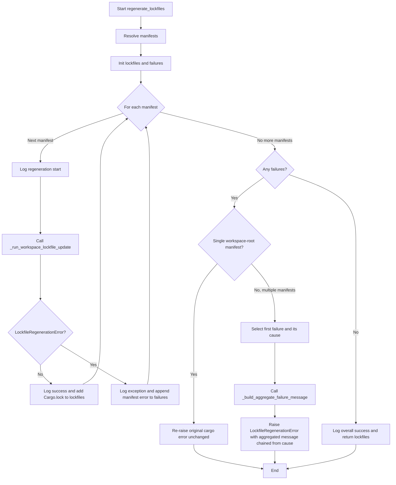

# Lading developer guide

This guide documents internal APIs, testing patterns, and development workflows
for contributors to `lading`. For the end-user CLI reference and `lading.toml`
configuration, see the [user guide](./users-guide.md). For repository operating
rules and required quality gates, see the [agent instructions](../AGENTS.md).

## Development invocation

The console script resolves to `lading.cli.main`. During development, the
implementation module may be invoked directly:

```bash
uv run python -m lading.cli --help
```

## Build environment

The Makefile resolves the `uv` executable through the `UV` variable:

```make
UV ?= $(shell command -v uv 2>/dev/null || printf '%s/.local/bin/uv' "$$HOME")
```

When `uv` is available on `PATH`, `command -v uv` supplies the executable path.
If it is not on `PATH`, the Makefile falls back to `$HOME/.local/bin/uv`, which
matches the default user-local installation path used by the project
environment. Targets that create the virtual environment, sync dependencies,
run builds, or execute tests should depend on and invoke `$(UV)` rather than a
literal `uv` command, so Makefile validation and command execution use the same
resolved executable.

## Linting workflow

Run the Python lint gate with:

```bash
make lint
```

The target is deliberately three-tiered. Ruff runs first because it is fast,
handles broad style and correctness checks, and imports the stricter lint
policy used by `leynos/episodic`. If Ruff passes, the target runs `interrogate`
with `--fail-under 100` across `lading` to enforce **100% docstring coverage**.
If `interrogate` passes, the final tier runs Pylint through the pinned
`pylint-pypy-shim` tool under PyPy. The final tier is focused on rule families
that complement Ruff, especially logging format safety, pattern matching
checks, selected simplification checks, deprecated standard-library usage, file
hygiene, and design-size limits.
[ADR-003](adr/003-three-tier-python-linting.md) records the policy decision.

The relevant Makefile variables are:

- `RUFF_VERSION` — pinned Ruff version; defaults to `0.15.12`. Keep it in sync
  with the `ruff==` dev dependency in `pyproject.toml` and the
  `uv tool install ruff==` step in `.github/workflows/ci.yml`, bumping all
  three together to avoid version-skew lint failures.
- `RUFF` — the pinned Ruff command
  (`uv tool run --from ruff==$(RUFF_VERSION) ruff`) that the `fmt`,
  `check-fmt`, and `lint` targets invoke.
- `PYLINT_PYTHON` — Python executable used by `uv tool run`; defaults to `pypy`.
- `PYLINT_TARGETS` — directories passed to Pylint; defaults to
  `lading scripts tests`.
- `PYLINT_PYPY_SHIM_REF` — pinned `pylint-pypy-shim` revision.
- `PYLINT_PYPY_SHIM` — Git URL assembled from the pinned shim revision.
- `PYLINT` — full `uv tool run --python $(PYLINT_PYTHON)` invocation for the
  shimmed Pylint command.

The `lint` target depends on `ruff`, `build`, `uv`, and `interrogate`, so it
creates and syncs the virtual environment before checking virtual-environment
tools. Keep any future lint additions wired through Makefile prerequisites as
well as command invocations, so local failures remain early and clear.

Ruff and Pylint policy live in `pyproject.toml`. The Ruff configuration enables
preview rules, targets Python 3.13, imports the selected `episodic` rule set,
and bans deprecated `typing` aliases in favour of built-in collection types,
`collections.abc`, `collections`, `contextlib`, or `re` as appropriate. The
Pylint configuration keeps the pass opt-in by disabling all messages first and
then enabling only the chosen third-tier checks. Local ignores and thresholds
document existing codebase constraints that should be addressed as focused
cleanup work rather than incidental lint-gate churn.

## Testing hooks

Behavioural tests invoke the CLI as an external process and spy on the `python`
executable with [`cmd-mox`](./cmd-mox-usage-guide.md). Setting
`LADING_USE_CMD_MOX_STUB` to a truthy value such as `1` or `true` forces
publish pre-flight checks to be proxied through the cmd-mox inter-process
communication (IPC) server so that the suite can assert on
`cargo::<subcommand>` invocations without launching real tools. This pattern
keeps the tests faithful to real user interactions while still providing strict
control over command invocations. Use the same approach when adding new
end-to-end scenarios.

The end-to-end suite in `tests/e2e/` keeps git interactions real while stubbing
only `cargo` operations, using cmd-mox passthrough spies for `git status` when
publish runs with stub mode enabled.

## Property-based testing

[Hypothesis](https://hypothesis.readthedocs.io/) is a development dependency
used for property-based tests in the publish, bump, lockfile, and
workspace-utility test suites. Add Hypothesis to new test modules with:

```python
from hypothesis import HealthCheck, given, settings
from hypothesis import strategies as st
```

Property-based tests in the publish suite use
`@settings(max_examples=20, suppress_health_check=[HealthCheck.function_scoped_fixture])`
to keep continuous integration (CI) fast while still exercising a range of
inputs.

## Publish test infrastructure (`tests/unit/publish/conftest.py`)

The publish unit-test conftest exports the following shared helpers:

| Symbol                                 | Purpose                                                                               |
| -------------------------------------- | ------------------------------------------------------------------------------------- |
| `CARGO_PACKAGE`                        | `("cargo", "package", "--allow-dirty")` — expected package command tuple              |
| `CARGO_PUBLISH`                        | `("cargo", "publish", "--allow-dirty")` — expected live-publish command tuple         |
| `CARGO_PUBLISH_DRY_RUN`                | `("cargo", "publish", "--allow-dirty", "--dry-run")` — expected dry-run command tuple |
| `make_crate(root, name, ...)`          | Build a `WorkspaceCrate` under `root` with an on-disk `Cargo.toml`                    |
| `make_workspace(root, *crates)`        | Build a `WorkspaceGraph` for the given crates                                         |
| `make_config(**overrides)`             | Build a `LadingConfig` with test defaults                                             |
| `make_preflight_config(**overrides)`   | Build a `PreflightConfig` with test defaults                                          |
| `make_dependency_chain(root)`          | Return an alpha→beta→gamma three-crate chain                                          |
| `make_n_crate_chain(root, count)`      | Return a linear chain of `count` crates named `crate_0`…`crate_{n-1}`                 |
| `CallTrackingRunner`                   | Recording runner that captures `(command, cwd)` pairs without side effects            |
| `plan_with_crates(tmp_path, crates)`   | Plan publication for crates without workspace I/O                                     |
| `prepare_staging_root(plan, base_dir)` | Create staged crate directories matching a plan                                       |

`make_n_crate_chain` raises `ValueError` when `count < 1`. Use it in
parametrized and property-based tests that must exercise arbitrary chain sizes.

`CallTrackingRunner` is a callable class. Inject it as `command_runner` in
`PublishOptions`. After the run, inspect `.calls` for the ordered list of
`(command_tuple, cwd)` pairs.

## Bump command internals

`lading.commands.bump` coordinates manifest updates, documentation updates,
README adoption, and lockfile reporting. Keep user-facing summary construction
in `lading.commands.bump_output` rather than formatting messages inline in the
workflow.

`lading.commands.bump_output` is the sole owner of `BumpChanges` and all bump
result-message formatting; `bump.py` imports these helpers and must not
re-declare them. The `BumpChanges` record includes manifests, documentation
files, transposed readmes, and lockfiles that changed during a bump run.
Changed-category descriptions join with an Oxford comma for three or more
categories (for example, "2 manifest(s), 1 readme file(s), and 1 lockfile(s)").

`lading.commands.bump_readme` owns workspace README adoption during
`lading bump`. The module copies the workspace `README.md` into each crate that
sets `readme.workspace = true`, rewrites relative Markdown links so they
resolve from the crate directory, and leaves absolute URI targets unchanged.
Markdown links in fenced code blocks, indented code blocks, and inline code
spans are preserved verbatim.

`lading.commands.bump_lockfiles` owns Cargo lockfile discovery and regeneration
after manifest changes. It always includes the workspace root `Cargo.toml`,
validates configured nested manifests before invoking Cargo, and de-duplicates
resolved manifest paths.

For screen readers: the following flowchart traces `regenerate_lockfiles`. It
resolves the manifest list, then initializes empty `lockfiles` and `failures`
collections. It loops over every manifest, logging the start and calling
`_run_workspace_lockfile_update`; on success it records the crate's
`Cargo.lock` in `lockfiles`, and on `LockfileRegenerationError` it logs the
exception and appends the manifest and error to `failures`. After the loop, if
there were no failures it logs overall success and returns the regenerated
lockfiles; otherwise it raises — when only the workspace-root lockfile was
regenerated it re-raises the original cargo error unchanged, and when several
lockfiles were regenerated it selects the first failure's cause, builds an
aggregated failure message, and raises `LockfileRegenerationError` chained from
that cause.



_Figure 1: Control flow of `regenerate_lockfiles` — every manifest is
attempted, and per-manifest failures are collected and reported together after
the loop._

The aggregate branch shown applies when several lockfiles are regenerated; when
only the workspace-root lockfile is processed, its lone failure is re-raised as
the original cargo error rather than wrapped in the aggregate message.

`BumpOptions` carries the dependency-injection points used by
`lading.commands.bump.run`. The `command_runner` field accepts an optional
`CommandRunner`, matching the command-runner protocol used by publish
execution. When `command_runner` is `None`, bump falls back to the default
subprocess runner. Tests pass a runner explicitly so lockfile commands can be
observed without invoking real Cargo processes.

Bump-time crate-set derivation is centralized in the bump context: the
`excluded` and `updated_crate_names` sets are computed exactly once in
`bump._initialize_bump_context` and threaded to downstream helpers such as
`_update_crate_manifest`. Helpers must consume the context sets rather than
re-deriving them per crate, which would make manifest processing quadratic in
workspace size.

Option defaulting is the command layer's responsibility, not the CLI adapter's.
`cli.bump` forwards `rebuild_lockfiles` as the raw `bool | None` it received;
the only resolution against `configuration.bump.rebuild_lockfiles` happens in
`bump._initialize_bump_context`. (The Cyclopts TOML loader may hydrate the CLI
flag from `lading.toml` before dispatch, but `cli.bump` itself performs no
coalescing.)

Bump-time crate-set derivation is centralized in the bump context: the
`excluded` and `updated_crate_names` sets are computed exactly once in
`bump._initialize_bump_context` and threaded to downstream helpers such as
`_update_crate_manifest`. Helpers must consume the context sets rather than
re-deriving them per crate, which would make manifest processing quadratic in
workspace size.

`BumpChanges` records the user-visible files touched by a bump run. Its
`lockfiles` field contains the `Cargo.lock` files regenerated after manifest
updates. The output formatter labels these paths as `(lockfile)` so operators
can see which generated files need review and commit.

`lading.commands.bump_toml.DEPENDENCY_SECTIONS` is the canonical vocabulary of
Cargo dependency-section names (`dependencies`, `dev-dependencies`, and
`build-dependencies`). Modules that iterate dependency sections
(`bump_docs.update_toml_snippet_dependencies`,
`bump._workspace_dependency_sections`) or map dependency kinds to sections
(`bump._DEPENDENCY_SECTION_BY_KIND`) must derive from this constant rather than
re-declaring the literals, so a change to the recognized section set is made in
exactly one place.

### Model checking the formatting helpers

Three pure helpers in `lading/commands/bump_output.py` carry PEP 316
docstring contracts (`pre:`/`post:` lines):

- `_build_changes_description` — assembles the Oxford-comma-joined
  category description from a `BumpChanges` instance.
- `_format_header` — formats the top-level bump result header line.
- `_format_manifest_path` — formats a single manifest path for display
  in the bump output.

Run CrossHair symbolic-execution model checking against the first two
helpers with:

```bash
make crosshair
```

`crosshair-tool` is a dev dependency. `[tool.crosshair]` in
`pyproject.toml` sets per-path and per-condition timeouts to keep the
check bounded. `make crosshair` is **not** part of `make all` or CI; it
is an on-demand check intended for targeted verification when the
formatting helpers change.

`_format_manifest_path` keeps its `pre:`/`post:` contract but is
intentionally excluded from the `make crosshair` run. CrossHair 0.0.107
cannot construct a symbolic `pathlib.Path` proxy — it raises in
`intersect_signatures` on both CPython 3.13 and 3.14. Its behaviour is
instead covered by the Hypothesis property test in
`tests/unit/test_bump_command_internals.py`, which exercises
`_format_result_message` across a wide range of path inputs.

## Workspace discovery helpers

### Workspace path normalization (`lading/utils/path.py`)

`normalise_workspace_root(value)` is the shared helper that turns a
user-supplied workspace root into a canonical `Path`. Import it from
`lading.utils`:

```python
from lading.utils import normalise_workspace_root

normalise_workspace_root("~/workspace")  # -> absolute, ~ expanded
normalise_workspace_root(None)           # -> Path.cwd().resolve()
```

It accepts `Path`, `str`, or `None`. `None` selects the resolved current
working directory; any other value is expanded with `Path.expanduser` and
resolved with `Path.resolve(strict=False)`, so `~` is expanded, redundant
separators and `.`/`..` segments collapse, and the result is always absolute.
`strict=False` means a non-existent target is permitted rather than raising.

The implementation is pure `pathlib`
(`Path(value).expanduser().resolve(strict=False)`); it no longer round-trips
through `plumbum`'s `local.path`. `plumbum` is therefore a dev-only dependency,
used solely by the end-to-end test helpers. Callers across the codebase rely on
this helper for consistent path handling, including `lading.cli`,
`lading.config`, `lading.workspace.metadata.load_cargo_metadata`,
`lading.commands.bump`, and `lading.commands.publish`.

### Lockfile helpers (`lading/commands/lockfile.py`)

`discover_tracked_lockfiles(workspace_root, runner)` filters git-tracked
`Cargo.lock` files outside `target/` with adjacent `Cargo.toml` manifests.
Private helpers `_handle_git_ls_files_failure` and `_lockfiles_with_manifests`
perform the error-handling and path-filtering passes respectively.

Lockfile regeneration after `lading bump` is owned by
`lading.commands.bump_lockfiles.regenerate_lockfiles`, which runs
`cargo update --workspace` per configured manifest. The two cargo strategies
differ deliberately: bump refreshes existing pinned versions in place after
manifest rewrites, while publish only probes freshness read-only via
`cargo metadata --locked` and never regenerates.

`validate_lockfile_freshness(manifest_path, runner)` runs
`cargo metadata --locked --manifest-path ... --format-version=1`. It returns a
`LockfileFreshness` result that distinguishes fresh lockfiles, lockfiles that
Cargo says need updating under `--locked`, and unrelated Cargo failures.
`_validate_lockfile_freshness` in `publish_preflight.py` calls it before the
cargo check/test pre-flight.

`LockfileDiscoveryError` inherits `LadingError`; its messages include the git
failure detail.

### `load_cargo_metadata`

Import `lading.workspace.load_cargo_metadata` to execute `cargo metadata` with
the current or explicitly provided workspace root:

```python
from pathlib import Path

from lading.workspace import load_cargo_metadata

metadata = load_cargo_metadata(Path("/path/to/workspace"))
print(metadata["workspace_root"])
```

The helper normalizes the workspace path with `normalise_workspace_root`,
invokes `cargo metadata --format-version 1` through the active `CommandRunner`,
and returns the parsed JSON mapping. Any execution errors or invalid output
raise `CargoMetadataError` with a descriptive message, so callers can present
actionable feedback to users.

### Workspace graph model

`load_workspace` converts the raw metadata into a strongly typed
`WorkspaceGraph` model backed by `msgspec.Struct` definitions. The graph lists
each crate, its manifest path, publication status, and any dependencies on
other workspace members.

```python
from pathlib import Path

from lading.workspace import load_workspace

workspace = load_workspace(Path("/path/to/workspace"))
print([crate.name for crate in workspace.crates])
```

The builder reads each crate manifest with `tomlkit` to detect
`readme.workspace = true` directives while preserving document structure for
future round-tripping.

## Programmatic publish options

When invoking `lading.commands.publish.prepare_workspace` programmatically,
callers can customize behaviour via `PublishOptions`. The defaults are:

- `allow_dirty=True` — skip the git cleanliness guard. **Security note:** this
  means uncommitted changes are permitted by default; pass `allow_dirty=False`
  to enforce a clean working tree before staging.
- `live=False` — run `cargo publish --dry-run` rather than uploading crates.
- `build_directory=None` — create a fresh temporary directory for staging.
- `preserve_symlinks=True` — preserve symbolic links in the staged workspace.
- `cleanup=False` — leave the staging directory intact for inspection.

Additional parameters `configuration`, `workspace`, and `command_runner` allow
dependency injection for testing and are typically left unset.

Examples:

- `PublishOptions(preserve_symlinks=False)` — disable symlink preservation when
  staging the workspace (useful when external assets need to be copied rather
  than linked).
- `PublishOptions(cleanup=True)` — remove the temporary staging directory
  automatically at process exit instead of leaving it for inspection.
- `PublishOptions(allow_dirty=False)` — require a clean git working tree before
  proceeding with publish preparation.

## Publish command internals

`PublishOptions.allow_unpublished_workspace_deps` is a dry-run-only override
for release trains where one workspace crate depends on another crate version
that is part of the same publish plan but is not visible in the crates.io index
yet. When enabled, `lading publish` downgrades that specific index-lookup
failure to a warning and continues. The option is rejected at runtime when
`live=True`, so it cannot mask a real upload failure.

The CLI accepts `--allow-unpublished-workspace-deps`,
`--no-allow-unpublished-workspace-deps`, or an omitted value. The helper
`lading.cli._resolve_allow_unpublished_workspace_deps()` resolves that
tri-state command-line surface to the concrete boolean stored on
`PublishOptions`: omitted dry-run invocations resolve to `True`, omitted live
invocations resolve to `False`, and explicit values are honoured. This keeps
the command dataclass free of adapter-only state while preserving the dry-run
default expected by operators.

### Exception hierarchy (`lading.exceptions`)

`lading.exceptions.LadingError` is the package-level base class for domain
failures raised by lading itself. It extends `Exception` directly and gives
callers one stable type to catch when they want to handle expected lading
failures without also catching unrelated runtime errors from Python, Cargo, git
wrappers, or test doubles.

Every root domain exception should inherit from `LadingError`. More specific
exceptions should continue to inherit from the local root for their feature
area so existing handling remains precise:

| Root exception              | Module                             | Notes                                                                                           |
| --------------------------- | ---------------------------------- | ----------------------------------------------------------------------------------------------- |
| `ConfigurationError`        | `lading.config`                    | Base for configuration loading and validation failures.                                         |
| `WorkspaceModelError`       | `lading.workspace.models`          | Base for workspace graph/model validation failures.                                             |
| `CargoMetadataError`        | `lading.workspace.metadata`        | Base for cargo metadata execution and parsing failures.                                         |
| `CommandSpawnError`         | `lading.runtime.subprocess_runner` | Raised when the subprocess runner cannot spawn an external command.                             |
| `LockfileDiscoveryError`    | `lading.commands.lockfile`         | Raised when git cannot list tracked lockfiles.                                                  |
| `LockfileRegenerationError` | `lading.commands.bump_lockfiles`   | Raised when configured bump lockfile manifests are invalid or `cargo update --workspace` fails. |
| `PublishPlanError`          | `lading.commands.publish_plan`     | Raised when a publish plan cannot be constructed.                                               |
| `ReadmeTranspositionError`  | `lading.commands.bump_readme`      | Raised when the workspace README cannot be transposed into a crate during `lading bump`.        |
| `PublishPreparationError`   | `lading.commands.publish_manifest` | Raised when staged publish manifests or workspace assets cannot be prepared.                    |
| `PublishPreflightError`     | `lading.commands.publish_errors`   | Raised for local publish validation and pre-flight failures.                                    |

Domain ownership: README transposition failures during `lading bump` are owned
by the bump domain (`ReadmeTranspositionError`); publish staging failures are
owned by the publish domain (`PublishPreparationError`). Bump modules must not
import publish-domain error types for unrelated conditions, and vice versa.

Reuse plan:

- New command, workspace, and configuration modules should define exactly one
  local root exception that subclasses `LadingError` when they introduce a new
  failure family.
- Subclasses should inherit from that local root, not from `LadingError`
  directly, unless they are themselves the root of a new family.
- Do not inherit lading domain exceptions from `RuntimeError`; reserve
  `RuntimeError` for unexpected programming errors or third-party APIs that
  already expose it.
- Keep messages useful at the boundary where they are raised. Include the
  relevant path, crate name, command, or configuration key so CLI handlers can
  report the exception without reconstructing context.

Usage guidance:

- CLI and integration boundaries may catch `LadingError` to render expected
  lading failures as user-facing diagnostics.
- Feature code should catch the narrowest local exception it can handle, such
  as `PublishPreflightError` or `LockfileRegenerationError`, and let unrelated
  `LadingError` subclasses propagate.
- Tests should assert the specific exception type for the behaviour under test,
  then use `LadingError` only when verifying common boundary handling.

`lading.commands.publish_errors` defines the public error boundary for publish
orchestration. Both publish exceptions inherit from the package-level
`LadingError` base and carry their message through the standard `args` tuple.

| Exception               | Raised when                                                                                                                                                                                                                                    |
| ----------------------- | ---------------------------------------------------------------------------------------------------------------------------------------------------------------------------------------------------------------------------------------------- |
| `PublishPreflightError` | A local check fails before publication begins — dirty working tree, auxiliary build failure, failed `cargo check`/`cargo test` preflight, or an invalid option combination (e.g. `--live` combined with `--allow-unpublished-workspace-deps`). |
| `PublishError`          | A `cargo publish` invocation fails after pre-flight checks have passed. Subclasses `PublishPreflightError`.                                                                                                                                    |

Callers of `lading.commands.publish.run` may catch `PublishPreflightError` to
handle both validation and publish-phase failures through one `except` clause,
or catch `PublishError` first when publish-phase failures require distinct
handling.

### Extracted publish modules

`publish_plan.py` owns publication planning and plan rendering. Its
`PublishPlan` dataclass is the immutable boundary between workspace analysis
and execution: it stores the workspace root, publishable crates in the resolved
order, crates skipped by manifest/configuration, and configured exclusions that
did not match a workspace crate. `plan_publication()` builds that object by
filtering non-publishable crates, applying `publish.exclude`, validating
`publish.order` when present, or deriving a deterministic dependency order.

`publish_manifest.py` owns staging-time manifest mutations. It contains
workspace preparation types and helpers that copy the workspace tree and apply
the `publish.strip_patches` strategy to the staged `Cargo.toml`. These
operations run before any `cargo package` or `cargo publish` command, so the
command runner works against a prepared snapshot rather than the source
workspace. Workspace README adoption is not performed here; the `lading bump`
command transposes the workspace README into each opted-in crate before
publication.

`publish_diagnostics.py` owns compiletest failure enrichment. When a cargo
pre-flight test failure mentions compiletest-style `*.stderr` artefacts, the
diagnostic helper locates the referenced files, tails a bounded number of
lines, and appends those snippets to the `PublishPreflightError` message. The
module is deliberately read-only: missing artefacts or unreadable files produce
diagnostic notes rather than replacing the original cargo failure.

`cargo_output_adapter.py` owns parsing raw cargo subprocess output into
structured command failures. `CargoIndexLookupFailure` is the value object for
crates.io index lookup failures, and `parse_index_lookup_failure()` is the
primary owner of cargo's marker-based index-miss detection.

`publish_index_check.py` owns crates.io index-lookup downgrade decisions after
output has crossed that adapter boundary. It receives `CargoIndexLookupFailure`
instances, applies crate-name canonicalization, and decides whether an index
miss is out-of-plan and fatal, in-plan but still fatal, or in-plan and
downgraded by `allow_unpublished_workspace_deps` during dry-run publication.

### `_PublishExecutionOptions`

`_PublishExecutionOptions` is a frozen dataclass that carries the runtime flags
forwarded to every `cargo package` and `cargo publish` invocation within a
single `lading publish` run. Its fields are:

| Field                              | Type   | Default | Purpose                                                              |
| ---------------------------------- | ------ | ------- | -------------------------------------------------------------------- |
| `live`                             | `bool` | —       | When `True`, omits `--dry-run` from `cargo publish`.                 |
| `allow_dirty`                      | `bool` | —       | Passes `--allow-dirty` to both cargo subcommands.                    |
| `allow_unpublished_workspace_deps` | `bool` | `False` | Dry-run-only override; see `allow_unpublished_workspace_deps` above. |

The dataclass is an internal implementation detail; callers interact with the
public `PublishOptions` dataclass, which `run()` converts before dispatching.

### Publication orchestration helpers

`_validate_publication_options(options)` is the first publish-specific guard in
`run()`. It rejects invalid option combinations before workspace loading or
staging begins. Today that means `live=True` cannot be combined with
`allow_unpublished_workspace_deps=True`, because the sibling-dependency
index-lookup downgrade is only valid for dry-run workflows.

`_execute_live_publication_pipeline(plan, preparation, *, options, runner)` is
the live-mode dispatcher. It walks `PublishPlan.publishable` in order and runs
`cargo package` followed by `cargo publish` for each crate before advancing to
the next crate. It logs per-crate progress, records completed crates for abort
diagnostics, and normalizes staging/preparation failures into
`PublishPreflightError` so callers receive the same publish command error
boundary.

`_handle_publish_result(crate, exit_code, stdout, stderr, plan, options)` owns
the result classification for a completed `cargo publish` command. It logs
success, skips already-published crate versions, adapts crates.io index lookup
failures through `parse_index_lookup_failure()` before delegating to
`_handle_index_missing_version`, and raises `PublishError` for all other
non-zero publish exits after formatting the cargo failure message.

`_CargoPreflightOptions` lives in `publish_preflight.py` and carries the
per-invocation settings for cargo pre-flight commands: extra cargo arguments,
test exclusions, unit-test-only narrowing, environment overrides, and optional
stderr-tail diagnostics. `_run_preflight_checks` builds these option objects for
`cargo check` and `cargo test` so command construction stays explicit and
testable.

Design review (issue #72): `_dispatch_publication` and
`_PublicationPipelineState` were assessed after contradictory static-analysis
advice (one finding asked for the extraction; another called the bundle and the
wrapper unnecessary). Both stay. `_dispatch_publication` owns the pipeline-mode
logging and the dry-run two-phase sequencing, keeps `run()` linear, and is the
seam the dispatch tests exercise directly. `_PublicationPipelineState` keeps
the per-crate helper signatures within the four-argument lint ceiling and pins
the invariant that plan, preparation, and options are constructed together and
immutable for the pipeline's lifetime.

Publication dispatch deliberately differs by mode. Dry-run mode keeps the
historical two-phase pipeline: package every publishable crate, then run
`cargo publish --dry-run` for every crate. Live mode interleaves the pipeline
per crate: package the next crate, publish it, then advance to the next entry in
`PublishPlan.publishable`. That ordering lets dependent crates resolve newly
uploaded in-plan dependencies during a single live release train. The live
pipeline does not roll back earlier uploads if a later crate fails; reruns rely
on the already-published detection path to log and skip versions already
visible in the registry.

The index-lookup handling is split across the adapter and decision helper:

- `parse_index_lookup_failure(*, crate_name, subcommand, result: CargoSubprocessResult)`
  checks for both Cargo's version-selection failure marker and the crates.io
  index marker after confirming the command failed. It accepts a
  `CargoSubprocessResult` value object (carrying `exit_code`, `stdout`, and
  `stderr`) and returns a `CargoIndexLookupFailure` or `None`. Requiring both
  markers minimizes false positives from unrelated resolver, registry, or
  command failures.
- The adapter parses the missing crate name from Cargo's requirement line. The
  regex accepts Cargo's backtick, single-quote, and double-quote delimiters
  around the requirement, captures the dependency name before `=`, and searches
  `stderr` before `stdout` because Cargo normally reports this failure on the
  error stream.
- `_handle_index_missing_version(failure, *, handling, error_cls)` applies the
  decision tree. If name extraction fails, the original Cargo failure stays
  fatal. If the parsed name is not in the publish plan, the failure is fatal
  with guidance to publish or index that dependency first. The helper checks
  projected availability by comparing publish-order positions and raises for
  out-of-plan, self, or late dependencies. If the parsed name is in the plan and
  `allow_unpublished_workspace_deps` is set, the helper logs a warning and
  continues; otherwise it raises with guidance to enable the dry-run
  unpublished workspace dependency override or follow the staged-publish
  workaround.

### Supporting types

`_IndexMissingVersionFailure` (frozen dataclass) Carries the four values
required by every fatal-path helper: `error_cls` (the exception type to raise),
`failure` (the `CargoIndexLookupFailure` that triggered the handler),
`failure_message` (the pre-formatted human-readable error string), and
`logger`. Constructing it once in `_handle_index_missing_version` and passing
it to helpers eliminates argument repetition and keeps each helper to two
parameters, satisfying the PLR0913 argument-count threshold.

`_IndexMissingVersionHandling` (frozen dataclass) Carries the ambient context
for the entire handler call: the active `PublishPlan`, the
`_PublishExecutionOptions`, and `logger`.

### Command-failure detail helpers (`lading.utils.process`)

`command_detail(stdout, stderr) -> str` returns the most informative output
stream for a failed command: stderr stripped of whitespace when non-empty,
otherwise stdout stripped, otherwise the empty string.

`append_detail(message, detail, *, separator=": ") -> str` appends an
_already-derived_ `detail` to `message` using `separator` only when `detail` is
non-empty. Reach for it when the caller has already computed the detail (for
example via `command_detail` to branch on its content) and must not derive it
twice — `_verify_clean_working_tree` inspects the detail to decide whether to
mention "is this a git repository?" before appending it.

`with_detail(message, stdout, stderr, *, separator=": ") -> str` is the
convenience wrapper that derives the detail with `command_detail` and appends
it with `append_detail` in one call.

These are the canonical home for the `(stderr or stdout)` failure-detail idiom.
Modules that render command failures (`lading.commands.lockfile`,
`lading.commands.bump_lockfiles`, `lading.commands.publish_preflight`,
`lading.commands.publish_index_check`, `lading.workspace.metadata`) must call
these helpers rather than re-implementing the idiom inline.

### Shared message helpers

`_format_missing_dependency_failure(failure, *,`
`missing_name, reason, guidance) -> str` Builds the human-readable fatal error
string from the pre-formatted cargo failure text, the extracted dependency
name, a domain-language reason clause, and an operator guidance sentence. All
fatal-path helpers delegate message construction here, centralizing the text
format.

`_log_missing_dependency_failure(logger, lookup_failure, *, missing_name, detail)`
-> `None` Emits a WARNING-level log entry for fatal index-missing-version
paths, providing consistent phrasing across all raise helpers so log
aggregation can match on a stable prefix.

### Fatal-path helpers

Each of the following accepts an `_IndexMissingVersionFailure` context object
and a keyword-only `missing_name` argument, then raises unconditionally (return
type `typ.NoReturn`):

- `_raise_name_extraction_failure(context)` — invoked when the dependency name
  cannot be parsed from the cargo diagnostic output.
- `_raise_out_of_plan_dependency(context, *, missing_name)` — invoked when the
  missing dependency is absent from the publish plan entirely.
- `_raise_self_dependency(context, *, missing_name)` — invoked when the failing
  crate's unresolved dependency resolves to itself after name canonicalization.
- `_raise_out_of_order_dependency(context, *, missing_name)` — invoked when the
  missing dependency is in the plan but at a higher publish-order index than
  the current crate.
- `_raise_unpublished_dependency_override_required(context, *, missing_name)`
  — invoked when the dependency is in the plan and ordered correctly but the
  unpublished workspace dependency override is disabled.

#### Crate-name canonicalization

`_canonical_crate_name(name)` normalizes a crate name by replacing every hyphen
with an underscore. It is applied by building a canonical publish-order index
and looking up both the current crate and missing dependency by canonical name:

```python
publishable_name_indexes = {
    _canonical_crate_name(entry.name): index
    for index, entry in enumerate(handling.plan.publishable)
}
current_index = publishable_name_indexes.get(_canonical_crate_name(context.failure.crate_name))
missing_index = publishable_name_indexes.get(_canonical_crate_name(missing_name))
```

This is necessary because Cargo error diagnostics may report a missing
dependency using hyphens (e.g. `my-crate`), while the corresponding
`Cargo.toml` entry and the `PublishPlan` store the same package name with
underscores (e.g. `my_crate`). Without normalization, a hyphenated cargo
diagnostic would be incorrectly classified as an out-of-plan dependency and
raise a fatal error instead of triggering the downgrade path.

`_format_cargo_failure_message(command, crate_name, exit_code, output)`
assembles the human-readable error string that is embedded in every
`PublishPreflightError` or `PublishError` raised on a non-zero cargo exit. It
is a pure function with no side effects: given the cargo subcommand string, the
crate name, the numeric exit code, and the `(stdout, stderr)` pair, it returns
a formatted message that includes all four values. Using a single function for
message construction keeps the error format consistent across the packaging and
publish phases and makes snapshot testing straightforward.

### Shared TOML coercion (`lading.toml_coerce`)

`lading.toml_coerce` is the canonical home for the TOML scalar, sequence, and
mapping coercion helpers shared by `lading.config` and
`lading.workspace.models`. Each helper takes an `error` keyword naming the
`LadingError` subclass to raise, and both consumers bind their domain error
type once with `functools.partial` (`ConfigurationError` in `config`,
`WorkspaceModelError` in `models`); neither module re-declares a coercer. The
canonical error-message shape is
`{field} must be {expected}; received {type(value).__name__}.` and is pinned by
property and snapshot tests in `tests/unit/test_toml_coerce.py`.

### Module size extractions (issue 108)

To keep source files within the 400-line guideline, the following
responsibilities live in dedicated modules, imported by their original homes:

- `lading.commands.bump_manifests` — per-manifest version and
  dependency-section rewriting plus the `_BumpContext` construction contract
  (imported by `bump`).
- `lading.workspace.graph_build` — builders converting `cargo metadata`
  output into workspace models; the error-bound coercion helpers live in
  `lading.workspace._coercion` (both imported by `workspace`).
- `lading.cli_options` — Cyclopts argument declarations and version-argument
  validation (imported by `cli`).

### In-process metrics (`lading.utils.metrics`)

`lading.utils.metrics` is a process-local metrics accumulator. Counters are
recorded with `increment_counter(name, **labels)` and flushed as a single
structured JSON log line at interpreter exit (`emit_summary`, registered via
`atexit`); runs that record no metrics emit nothing. The module deliberately
avoids exporter dependencies such as `prometheus_client` or `statsd`: a lading
invocation is a short-lived CLI process whose logs are already aggregated, so
the summary line is the operational boundary. Tests use `counter_value`,
`duration_stats`, `snapshot`, and `reset` as deterministic seams.
[ADR-004](adr/004-in-process-metrics-backend.md) records this backend decision,
including why label values such as `missing_crate` are kept verbatim rather
than bucketed.

Defined metrics:

| Metric                           | Labels                        | Incremented when                                                                                                      |
| -------------------------------- | ----------------------------- | --------------------------------------------------------------------------------------------------------------------- |
| `publish.index_lookup_downgrade` | `subcommand`, `missing_crate` | `_handle_index_missing_version` downgrades a crates.io index-lookup failure to a warning (in-plan, override enabled). |
| `lockfile.discovered`            | (none)                        | Incremented by the number of tracked lockfiles each `discover_tracked_lockfiles` call returns.                        |
| `lockfile.validate`              | `outcome`                     | One increment per `validate_lockfile_freshness` call; `outcome` is `fresh`, `stale`, or `failed`.                     |
| `lockfile.validate.duration`     | (none)                        | Duration observation around each `cargo metadata --locked` probe.                                                     |

Duration metrics aggregate a count and total seconds per label set via
`observe_duration` / `duration_stats` and appear in the exit summary with
`count` and `total_seconds` fields.

### Command runners (`lading.runtime`)

`lading.runtime` owns the shared `CommandRunner` protocol and the production
`subprocess_runner` adapter. Command modules type against this protocol so
tests can inject cmd-mox or recording runners without depending on
publish-specific infrastructure.

`lading.commands.publish_execution` still owns publish-specific error mapping
around command execution. `lading bump` uses the runtime runner directly for
lockfile refreshes, while `lading publish` uses `_invoke` where failures should
surface as `PublishPreflightError`.

The cmd-mox runner validates `CMOX_IPC_TIMEOUT` in `_resolve_cmd_mox_timeout`.
The two operator-facing messages it raises live as a single source of truth in
the module constants `INVALID_IPC_TIMEOUT_MESSAGE` and
`NON_POSITIVE_IPC_TIMEOUT_MESSAGE` in `lading/testing/cmd_mox_runner.py`; their
values are pinned by a syrupy snapshot. See the
[cmd-mox usage guide](./cmd-mox-usage-guide.md#environment-variables) for the
operator-facing description of the variable and its failure modes.

#### Subprocess invocation logging

`subprocess_runner` emits **exactly one** log record per external command
invocation:

- **INFO** — `Running external command: <cmd> [<args>]` (with an optional
  `(cwd=<path>)` suffix when a working directory is supplied). This is the
  operationally visible record.
- **DEBUG** (separate, only when environment overrides are present) — a
  redacted summary of the environment variables that differ from the ambient
  process environment.

No second invocation record is emitted at DEBUG level. Any regression that
reintroduces a second invocation log at any level is pinned by the tests in
`tests/unit/test_subprocess_runner_logging.py`.

### Pre-flight validation (`publish_preflight`)

`lading.commands.publish_preflight` performs workspace validation before any
crate is packaged or published. It is the canonical (and only) home of
`_run_preflight_checks` and `_preflight_argument_sets`. `publish.py`
re-exports `_preflight_argument_sets` as a bare module-level alias for
backwards compatibility with existing test patches, and must not re-declare
it. `_run_preflight_checks`, however, is exposed through a thin wrapper in
`publish.py` that preserves the historical optional-`configuration` contract
(resolving configuration via `_ensure_configuration` when the caller omits
it) before delegating to the canonical implementation. The public entry
point is:

```python
_run_preflight_checks(
    workspace_root: Path,
    *,
    allow_dirty: bool,
    configuration: LadingConfig,
    runner: CommandRunner | None = None,
) -> None
```

The function verifies the git working tree is clean (unless `allow_dirty` is
set), then executes `cargo check` and `cargo test` in a temporary
`--target-dir` to keep preflight artefacts separate from the workspace's own
target directory. A non-zero exit from any step raises `PublishPreflightError`
with a descriptive message.

| Helper                         | Purpose                                                                                       |
| ------------------------------ | --------------------------------------------------------------------------------------------- |
| `_compose_preflight_arguments` | Builds the base `cargo` argument tuple for a given target directory and `--all-targets` flag. |
| `_preflight_argument_sets`     | Returns `(check_args, test_args)` tuples adapted for unit-test-only mode.                     |
| `_run_cargo_preflight`         | Executes a single `cargo check` or `cargo test` invocation and raises on failure.             |
| `_verify_clean_working_tree`   | Runs `git status --porcelain` and raises if the tree is dirty and `allow_dirty` is `False`.   |

### Per-crate publication helpers

`_package_crate` and `_publish_crate` are the atomic units of the publication
pipeline. Both accept the crate entry, publication state, and command runner
explicitly, then execute exactly one `cargo` invocation against the crate's
staging root:

```python
_package_crate(
    crate: WorkspaceCrate,
    state: _PublicationPipelineState,
    *,
    runner: _CommandRunner,
) -> None
_publish_crate(
    crate: WorkspaceCrate,
    state: _PublicationPipelineState,
    *,
    runner: _CommandRunner,
) -> None
```

`_CrateAction` is the shared `typing.Protocol` for single-crate pipeline
steps; its `__call__` signature is `(crate, state, *, runner) -> None`,
matching `_package_crate` and `_publish_crate` exactly.
`_for_each_publishable_crate(state, *, runner, action: _CrateAction) -> None`
iterates `state.plan.publishable` in pipeline order and applies `action` to
each crate; both `_package_publishable_crates` and `_publish_crates` delegate
to it, passing `_package_crate` or `_publish_crate` as the action
respectively. The live pipeline (`_execute_live_publication_pipeline`)
deliberately bypasses this helper and manages its own loop, interleaving
`_package_crate` and `_publish_crate` per crate so that a freshly packaged
crate is uploaded before packaging begins for the next. New per-crate steps
intended for the batched (dry-run) pipeline should therefore be written as
`_CrateAction`-conforming functions dispatched through
`_for_each_publishable_crate`; steps that must interleave packaging and
publishing belong in the live pipeline instead.

`_PublicationPipelineState` carries only publish-domain state: the resolved
`PublishPlan`, the `PublishPreparation`, and `_PublishExecutionOptions`.
Infrastructure stays at the call boundary: `_CommandRunner` is passed directly
to each pipeline/helper function rather than being bundled into the state.

`_dispatch_publication` selects the live or dry-run pipeline and delegates
accordingly. It is the sole branch that decides between the interleaved
per-crate flow and the historical two-phase batch flow, keeping `run()` free of
that decision.

`lading.commands.publish_execution` loads the optional `cmd_mox` command-runner
module with `importlib.import_module("cmd_mox.command_runner")`. Keeping the
module in an `object | None` variable avoids relying on
`from cmd_mox import ...  # type: ignore` when the package is absent, and it
prevents conflicting type declarations when `cmd_mox` is present in the type
checker environment.
