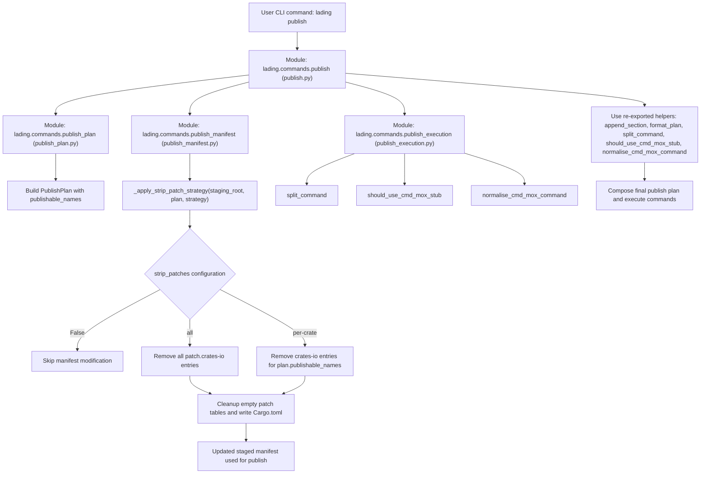
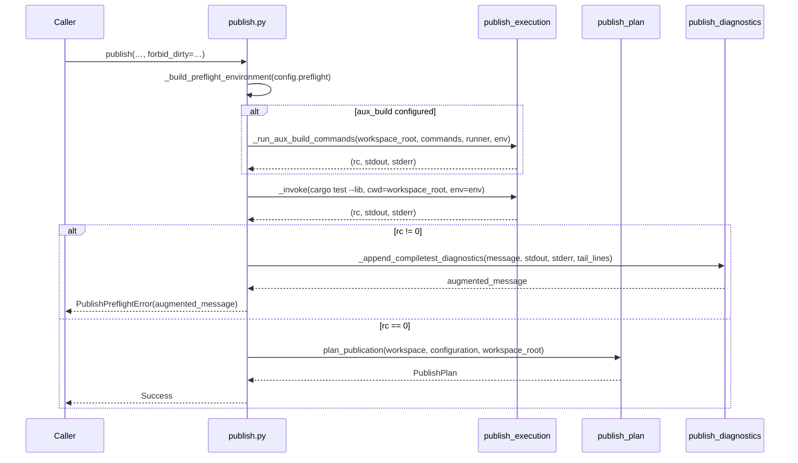

# Design Document: Lading Crate Management Tool

Version: 1.0\
Status: Proposed\
Date: 05 October 2025

## 1. Introduction

### 1.1. Purpose

This document specifies the design for a generalised, configuration-driven
Python utility named `lading`. This tool will streamline versioning and
publication workflows for arbitrary Rust workspaces. It is intended to
supersede and replace the existing, repository-specific `bump_version.py` and
`run_publish_check.py` scripts, abstracting their core logic into a reusable
and robust command-line application.

### 1.2. Scope

The project encompasses the following key deliverables:

1. A unified command-line interface (CLI) tool, `lading`, built with
   `cyclopts`, providing `bump` and `publish` subcommands.
2. A single, unified TOML configuration file, `lading.toml`, to define
   workspace-specific behaviours, minimising the need for command-line
   arguments.
3. A workspace discovery mechanism that infers the dependency graph, crate
   locations, and publication order by parsing the output of `cargo metadata`.
4. A `bump` command to propagate version changes across the workspace,
   including `Cargo.toml` files for both the workspace and individual crates,
   and to synchronise documentation files.
5. A `publish` command to execute pre-publish checks and publish crates to a
   registry in the correct topological order, with support for both dry-run and
   live modes.
6. Support for the `readme.workspace = true` manifest key, ensuring the
   workspace's `README.md` is copied to member crates before packaging.

### 1.3. Goals

- **Decoupling:** Eliminate hardcoded paths, crate names, and
  repository-specific assumptions from the tooling.
- **Generalisation:** Create a tool that can be applied to any Rust workspace
  with minimal configuration.
- **Automation:** Reduce manual effort and the risk of human error in release
  processes.
- **Configuration over Code:** Favour declarative configuration in
  `lading.toml` over imperative logic within the tool itself.
- **Clarity and Maintainability:** Establish a clean, well-tested Python
  codebase that is easy to understand and extend.

### 1.4. Current coupling

#### `run_publish_check.py`

- The workflow is driven by the statically defined
  `PUBLISHABLE_CRATES` tuple imported from `publish_workspace_members`, which
  hard-codes the crate list and release ordering for this repository.
- Crate directories are resolved under `<workspace>/crates/<name>`, which only
  matches the current workspace layout and fails for workspaces that colocate
  crates elsewhere.
- Live publish commands and the locked publish variant are keyed off concrete
  crate names, making the publish pipeline unusable when the workspace contains
  a different set of packages.
- The dry-run mode packages one crate and checks others based on crate names,
  which will not hold in a generic workspace.

#### `bump_version.py`

- Member version updates assume that `ortho_config` should bump
  `ortho_config_macros` together, coupling the script to rstest-bdd-specific
  crates.
- Documentation updates only rewrite TOML fences that reference the
  `ortho_config` dependency and only touch `README.md` and
  `docs/users-guide.md`, missing other files in a different workspace layout.
- The script derives the workspace root as two directories above the script,
  preventing reuse when the tools are vendored into another project or invoked
  against a different repository.

## 2. Core Components

### 2.1. The `lading` Command-Line Interface

The primary user interaction point will be the `lading` CLI. It will be
implemented using the `cyclopts` library to provide a modern, type-annotated,
and environment-aware interface.

The structure will be as follows:

```shell
lading [--workspace-root <path>] <subcommand> [options]
```

- `--workspace-root`: An optional global flag to specify the path to the Rust
  workspace root. If omitted, it defaults to the current working directory.
- **Subcommands:**

- `bump`: Manages version bumping.
- `publish`: Manages the publication process.

#### Implementation notes (Step 1.1)

- The initial CLI scaffolding lives in `lading/cli.py` and exposes a
  `main()` entry point alongside the `cyclopts.App` instance. Packaging wires
  this entry point through a `lading` console script for ergonomic execution.
- `--workspace-root` is implemented as a global flag that can be positioned
  before or after the subcommand. The bootstrapper removes the flag from the
  argument list, normalises it via the shared
  `lading.utils.normalise_workspace_root` helper (backed by `plumbum.local`),
  and stores the resolved path in the `LADING_WORKSPACE_ROOT` environment
  variable so that Cyclopts can hydrate per-command options without bespoke
  parsing hooks.
- Subcommands currently dispatch to placeholder implementations that return a
  human-readable acknowledgement. The CLI prints these messages to aid smoke
  testing while we build out real behaviours in later roadmap steps.
- Behavioural coverage uses `pytest-bdd` with `cmd-mox` spies to exercise the
  CLI through an actual `python -m lading.cli` invocation. This ensures the
  scaffolding works end-to-end, not just through direct function calls.
- Configuration loading is centralised in `lading/config.py`. The module builds
  a `cyclopts.config.Toml` loader anchored at the workspace root, validates the
  resulting data with frozen dataclasses, and exposes a context manager so that
  downstream code can access the active configuration without passing it
  through every call. The CLI sets up this context before dispatching a
  subcommand and falls back to on-demand loading when commands are invoked
  programmatically.

### 2.2. Configuration: `lading.toml`

A `lading.toml` file located at the workspace root defines the tool's
behaviour. When the file is absent the CLI treats it as an empty document and
runs with the default configuration, so workspaces can opt in to overrides
incrementally. The design prioritises inference to keep this file as minimal as
possible.

**Schema Definition:**

```toml
# lading.toml

# `bump` table: Configuration for the 'bump' command.
[bump]
# A list of crate names to exclude from the version bump process.
# The tool will infer all publishable crates by default and apply
# version bump to these.
# exclude = []

# `publish` table: Configuration for the 'publish' command.
[publish]
# A list of crate names to exclude from the publishing process.
# Useful for examples, internal tools, or private crates within the workspace.
# The tool will infer all publishable crates by default.
# exclude = []

# Optional explicit ordering for publication. If not specified, the tool
# will determine the order topologically from the dependency graph.
# This should only be used to resolve ambiguity or enforce a specific sequence.
# Crate names listed here must be valid members of the workspace.
# order = ["crate-a", "crate-b"]

# Strategy for stripping [patch.crates-io] directives from Cargo.toml during
# publication. This is often necessary to ensure the registry uses published
# versions of workspace dependencies instead of local path overrides.
#
# Possible values:
# - "all": The entire [patch.crates-io] section is removed from the temporary
#   workspace manifest before any checks are run.
# - "per-crate": Before publishing each crate, its specific entry is removed
#   from the [patch.crates-io] section. This allows subsequent crates in the
#   publish order to still resolve local paths.
# - false: No patches are stripped.
#
# If unset, the tool defaults to "all" for dry runs and "per-crate" for live
# runs.
strip_patches = "per-crate"
```

Implementation detail: the publish command rewrites the staged workspace
`Cargo.toml` immediately after cloning the workspace tree. The helper loads the
manifest with `tomlkit` so formatting and comments survive the transformation
and either removes the entire `[patch.crates-io]` table when the strategy is
`"all"` or deletes only the entries whose crate names appear in the publish
plan when using `"per-crate"`. Setting the value to `false` leaves the patch
table untouched so bespoke overrides (for example, third-party forks) remain
available during packaging. Any parse errors or missing manifests surface as
`PublishPreparationError` to keep the staging workflow predictable.

#### Publish data flow

The publish data flow shows how the publish command orchestrates manifest
preparation, crate planning, and command execution. The workflow splits
configuration-driven patch stripping logic (all vs. per-crate) based on dry-run
and live modes, and feeds the resulting plan to execution helpers.



### 2.3. Workspace Discovery and Model

The tool's internal representation of the workspace is critical for its
operation. This model will be constructed at runtime by executing
`cargo metadata --format-version 1` and parsing its JSON output. This approach
is superior to manual TOML parsing as it correctly handles path dependencies,
build scripts, and complex workspace configurations.

#### Implementation notes (Step 1.2)

- Workspace discovery is anchored in `lading.workspace.metadata`. The module
  uses `plumbum` to construct `cargo metadata --format-version 1`, normalising
  the workspace root via `lading.utils.normalise_workspace_root` before
  invoking the command.
- Failures to locate the `cargo` executable raise
  `CargoExecutableNotFoundError`; non-zero exit codes raise
  `CargoMetadataInvocationError`; malformed JSON payloads raise
  `CargoMetadataParseError`. Each derives from `CargoMetadataError`, giving
  higher layers a single umbrella type while preserving detail for logging.
- The wrapper returns the parsed JSON mapping directly. Later roadmap steps
  will build dedicated models on top of this structure without re-running the
  command or reparsing JSON.
- `lading.workspace.models` defines the `WorkspaceGraph`, `WorkspaceCrate`, and
  `WorkspaceDependency` types as `msgspec.Struct` instances so that workspace
  data is immutable and efficiently serialised.
- `build_workspace_graph` reads each crate manifest with `tomlkit` to detect
  `readme.workspace = true` entries while preserving formatting for later
  round-tripping.
- `load_workspace` constructs the graph once per CLI invocation and passes it
  to command handlers, allowing them to share discovery results without
  re-running `cargo metadata`.

The discovery process will populate an internal data structure representing the
workspace graph, containing:

- **Workspace Root:** The absolute path to the workspace directory.
- **Crate List:** A collection of all crates, each containing:

- `name`: The crate name (e.g., `my-crate`).
- `version`: The current version string.
- `path`: The absolute path to the crate's root directory.
- `manifest_path`: The absolute path to the crate's `Cargo.toml`.
- `publish`: A boolean indicating if the crate is intended for publication
  (derived from `package.publish` in `Cargo.toml`).
- `dependencies`: A list of its dependencies within the workspace. Each entry
  retains both the canonical crate name and the manifest key, so renamed
  dependencies (e.g., `alpha-core = { package = "alpha" }`) can be matched back
  to the correct manifest entry when updating requirements.
- `readme_is_workspace`: A boolean flag derived from checking if
  `package.readme.workspace` is `true`.

This internal graph enables reliable dependency resolution and topological
sorting for the `publish` command.

## 3. `bump` Subcommand Design

The `bump` command will synchronise versions across the workspace.

**Command Signature:**

```shell
lading bump <new_version> [--dry-run]
```

- `<new_version>`: The new semantic version string (e.g., `1.2.3`). This is a
  required argument.
- `--dry-run`: If present, the command will report all changes it would make
  without writing to any files.

**Execution Flow:**

1. **Discover Workspace:** Build the internal workspace model.
2. **Update Workspace **`Cargo.toml`**:** Set `workspace.package.version` to
   `<new_version>`.
3. **Update Member Crates:** For each crate in the workspace (not just
   publishable ones):

    - Update `package.version` in its `Cargo.toml`.
    - Iterate through its `[dependencies]`, `[dev-dependencies]`, and
      `[build-dependencies]`. If a dependency is a workspace member, update its
      version string to match `<new_version>`, preserving any existing version
      operators (e.g., `^`, `~`). This prevents version drift between internal
      crates.

4. **Handle Workspace READMEs:** For each crate where `readme_is_workspace` is
   `true`:

    - Copy the `README.md` file from the workspace root to the crate's
      directory, overwriting any existing file. This action will be performed
      _before_ any packaging step in the `publish` command but is conceptually
      part of the versioning workflow. The `bump` command will validate that
      this is possible.

5. **Update Documentation Files:** _(deferred to Step 2.2)_

    - Introduce configuration-driven glob patterns for documentation files.
    - For each matching file, scan for TOML fenced code blocks (three backticks
      with the language tag "toml").
    - Within each fence, parse the content and update the version of any
      dependency that is also a workspace member to `<new_version>`. This
      replaces the previous hardcoded logic.

6. **Report Changes:** Output a summary of all files that were (or would be)
   modified.

### Implementation notes (Step 2.1)

- Manifest rewrites use `tomlkit` so comments and formatting remain intact. The
  implementation updates both `[package]` and `[workspace.package]` sections in
  the workspace manifest when present.
- `bump.exclude` is respected when iterating workspace crates. Any crate name
  listed in the configuration keeps its existing `package.version` value during
  the update pass.
- Dependency requirements referencing workspace members are rewritten using the
  workspace graph. For each crate we map dependencies to their
  `[dependencies]`, `[dev-dependencies]`, or `[build-dependencies]` sections
  and update the requirement string only when the target crate's version
  changes. Leading operators such as `^` and `~` are preserved so caret and
  tilde semantics continue to apply.
- Crates excluded via `bump.exclude` still have their dependency requirements
  refreshed when they point at bumped members. This keeps the workspace graph
  consistent without forcing the excluded crate to change its own version.
- The command reports a concise summary that enumerates every manifest path on
  its own line. The live mode prefix is `Updated version to <version> in …`,
  while dry runs use `Dry run; would update version to <version> in …`. When no
  manifest requires changes the CLI reports:
  `No manifest changes required; all versions already <version>.`
- A `--dry-run` flag bypasses file writes entirely while still computing the
  manifest diff. This allows automation to preview the impact of a bump without
  touching the workspace.
- Version arguments are validated at the CLI layer before the workspace model
  loads. Invalid formats raise a user-facing error without touching the
  filesystem, while values may include optional pre-release and build metadata.
- The legacy `bump.doc_files` configuration knob has been retired until
  documentation rewriting arrives in Step 2.2 to avoid implying unsupported
  behaviour.

### Implementation notes (Step 2.2)

- `bump.documentation.globs` accepts glob patterns relative to the workspace
  root. Each pattern expands to a list of Markdown files that should have their
  TOML fences rewritten during a bump.
- Markdown fences are parsed with `markdown-it-py` so indentation and
  language info strings are preserved. The fence bodies are parsed with
  `tomlkit`, updating `[package]`, `[workspace.package]`, and dependency
  entries that reference workspace crates. Existing requirement operators and
  inline trivia remain intact.
- The publish workflow stages a clean workspace copy in a temporary directory
  before packaging. The staging directory must live outside the source tree to
  avoid recursive copies. Crates that opt into `readme.workspace = true`
  receive the root README within the staged workspace, and the CLI reports each
  copied path so operators can confirm the assets that will be packaged.
  Symbolic links remain links by default to avoid cloning large external trees;
  callers can opt into dereferencing by disabling `preserve_symlinks` via
  `PublishOptions`. Likewise, `PublishOptions(cleanup=True)` registers an
  `atexit` hook that removes the temporary build directory after the process
  exits.
- Documentation rewrites honour `--dry-run`; the command reports the files but
  skips writing to disk. The CLI summary now reports both manifest and
  documentation counts, and documentation entries are suffixed with
  `(documentation)` for clarity.

## 4. `publish` Subcommand Design

The `publish` command orchestrates the publication of crates to the designated
registry.

**Command Signature:**

```shell
lading publish [--live] [--forbid-dirty]
```

- `--live`: By default, the command simulates the entire process, including
  `cargo package` and `cargo publish --dry-run`, without uploading to the
  registry. Specifying `--live` takes the process to completion.
- `--forbid-dirty`: Require a clean working tree before running the pre-flight
  checks. When omitted the git status guard is skipped so that developers can
  iterate on pending changes.

**Execution Flow:**

1. **Discover Workspace:** Build the internal workspace model.
2. **Determine Publishable Crates:**

    - Filter the crate list to include only those where `publish` is not
      `false`.
    - Remove any crates listed in `publish.exclude` from `lading.toml`.
    - Record crates skipped by manifest settings and configuration so the CLI
      can explain how the plan was derived. Report any configuration exclusions
      that do not match workspace crates to help users prune stale entries.

3. **Determine Publish Order:**

    - If `publish.order` is defined in `lading.toml`, validate that it contains
      all publishable crates and use this order.
    - If `publish.order` is not defined, perform a topological sort on the
      dependency graph of publishable crates to generate the correct
      publication sequence. If the graph contains cycles, the command will
      abort with an error.

Implementation note: the planner now performs a deterministic topological sort
using Kahn's algorithm with a lexicographically ordered queue so that parallel
branches remain stable across runs. The resulting `PublishPlan` raises a
`PublishPlanError` when a cycle prevents ordering, surfacing the crates
involved to the operator. When `publish.order` is configured the planner
validates that every publishable crate appears exactly once and that no unknown
names are listed before returning the user-specified order.

1. **Prepare workspace manifest**: Within the workspace root, determine the
   patch stripping strategy based on the `publish.strip_patches` configuration
   value and the execution mode (`--dry-run` flag).

    - If strip_patches is "all" (or is unset and this is a dry run), remove the
      entire [patch.crates-io] section from the Cargo.toml.

2. **Execute pre-flight checks:** Before publishing, run a series of checks in
   the workspace itself to ensure integrity:

    - Run `cargo check --all-targets` for the entire workspace.
    - Run `cargo test --all-targets` for the entire workspace.

    Implementation detail: the command executes both cargo subcommands via
    `plumbum` directly in the workspace root so that any relative path
    dependencies remain accessible. Build artefacts are isolated by exporting a
    per-run target directory created with `tempfile.TemporaryDirectory`; the
    directory (and any compiled artefacts) is discarded automatically once the
    checks complete. A preceding `git status --porcelain` verifies that the
    working tree is clean only when operators pass `--forbid-dirty`. Skipping
    the flag leaves the guard disabled so local experiments can reuse the same
    entrypoint. For testing and controlled environments the helper honours the
    `LADING_USE_CMD_MOX_STUB` environment variable: when set to a truthy value
    (`1`, `true`, `yes`, or `on`) the pre-flight invocations contact the
    cmd-mox IPC server instead of spawning real processes. Each subcommand is
    encoded as `cargo::<name>` so that behavioural tests can record
    expectations without interfering with the `cargo metadata` stub used
    elsewhere.

    The configuration layer exposes a `[preflight]` table so workspaces can
    selectively skip crates during the `cargo test` pre-flight run. Entries in
    `preflight.test_exclude` translate directly into `--exclude <crate>` flags
    passed to the cargo invocation, letting release pipelines avoid expensive
    cucumber suites or other integration-heavy members while still validating
    the remaining crates. Setting `preflight.unit_tests_only = true` narrows
    the command to library and binary targets by appending `--lib --bins`,
    providing a lightweight alternative when integration and example tests are
    not required for release validation. Additional hooks support compiletest
    workflows:

    - `preflight.aux_build` – a list of auxiliary commands that run before the
      cargo invocations so rule crates can precompile UI helpers.
    - `preflight.compiletest_extern` – a mapping of crate names to artifact
      paths that Lading injects into `RUSTFLAGS` as `--extern` arguments for
      the cargo test invocation.
    - `preflight.env` – a table of environment overrides applied to every
      pre-flight command so localisation knobs such as `DYLINT_LOCALE` stay in
      sync with the surrounding harness.
    - `preflight.stderr_tail_lines` – the number of lines tailed from
      compiletest `*.stderr` files when cargo test fails, exposing the debug
      diff directly in the CLI output.

### Publish Preflight Sequence

The preflight sequence diagram illustrates the pre-flight checks that run
before crate publication. Auxiliary build commands (if configured) execute
first, followed by cargo check and cargo test with environment overrides
applied. Preflight failures abort the publish workflow; success advances to
crate-by-crate publishing.



### Publishing iteration

1. **Iterate and publish:** For each crate in the determined order:

    - **Patch Handling (per-crate)**: If strip_patches is "per-crate" (or is
      unset and this is a live run), remove the specific patch entry for the
      current crate from the Cargo.toml within the working tree snapshot being
      prepared for packaging.
    - **README Handling:** If the crate has `readme.workspace = true`, copy the
      workspace `README.md` into the crate's directory prior to packaging.
    - **Package:** Run `cargo package` to create the `.crate` file and verify
      its contents.
    - **Publish:** Run `cargo publish`. The command defaults to `--dry-run`
      so operators can validate the full pipeline safely; passing `--live`
      omits the flag and performs a real upload. When the registry reports
      that a crate version already exists, Lading logs a warning and
      continues to the next crate instead of aborting the publication loop.

## 5. Refactoring and Project Structure

The existing code from `crate_tools` will be refactored into a new Python
package structure for `lading`.

**Proposed Directory Structure:**

```plaintext
lading/
  ├── __init__.py
  ├── cli.py  # Cyclopts app definition and command wiring
  ├── commands/
  │   ├── __init__.py
  │   ├── _shared.py  # Command-level helper utilities
  │   ├── bump.py  # Logic for the `bump` subcommand
  │   └── publish.py  # Logic for the `publish` subcommand
  ├── config.py  # Frozen dataclasses for `lading.toml`
  ├── utils/
  │   ├── __init__.py
  │   └── path.py  # Filesystem helpers such as `normalise_workspace_root`
  └── workspace/
      ├── __init__.py
      ├── metadata.py  # `cargo metadata` invocation and parsing
      └── models.py  # Workspace graph and manifest helpers

tests/
  ├── conftest.py
  ├── fixtures/
  │   └── simple_workspace/
  │       ├── Cargo.toml
  │       └── lading.toml
  └── test_*.py
```

This structure separates concerns, improves testability, and establishes a
clear architecture for future development.

## 6. Testing Strategy

A robust testing strategy is essential for a tool that modifies source files
and performs releases.

- **Unit Tests:** Each module (`config.py`, `workspace/metadata.py`,
  `workspace/models.py`, command helpers) will have comprehensive unit tests.
  Logic within the `bump` and `publish` commands will be unit-tested with
  mocked filesystem and subprocess calls. Where behaviour is identical across
  inputs (for example, ensuring metadata decoding handles both text and byte
  streams) the suite will rely on parametrised tests to avoid duplication while
  exercising each variant.
- **Integration Tests:** The CLI itself (`cli.py`) will be tested using
  `cyclopts.testing.invoke`. These tests will run against mock workspaces
  defined in `tests/fixtures/` to verify command-line parsing, configuration
  loading, and the orchestration of different modules.
- **End-to-End Tests:** A small suite of end-to-end tests will operate on
  temporary Git repositories. These tests will initialise a Rust workspace,
  commit a `lading.toml`, and then execute `lading bump` and
  `lading publish --dry-run`, asserting that the files are correctly modified
  and the `cargo` commands are executed in the right sequence.

This multi-layered approach will ensure correctness from the lowest-level
utilities to the highest-level user-facing commands.

### Phase 4 testing updates

- Introduced `pytest-cov` as a development dependency, so coverage can be
  reported via `uv run pytest --cov` without additional tooling. Phase 4 sets a
  floor of >90% line coverage for new modules; focused unit tests now exercise
  configuration validation edges, publish manifest handling, cmd-mox IPC
  fallback mechanisms, and workspace model error paths to keep defensive code
  paths observable.
- End-to-end behavioural coverage now lives under `tests/e2e/` and executes
  the CLI in a temporary Git repository. The suite uses real git operations
  (`git init`, `git commit`, `git status`) while stubbing `cargo` interactions
  via cmd-mox (`cargo metadata`, `cargo::check`, `cargo::test`,
  `cargo::package`, and `cargo::publish`) so that workflows can be validated
  without a Rust toolchain.
- cmd-mox remains the default mechanism for mocking external commands. Tests
  covering publish pre-flight and `cargo metadata` IPC use stubbed cmd-mox
  modules rather than spawning real processes, keeping suites deterministic
  while still traversing streaming/IPC code paths.
