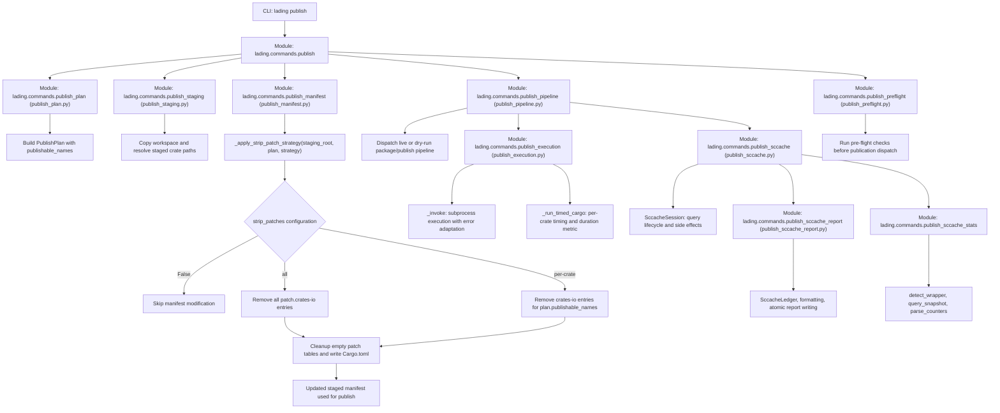
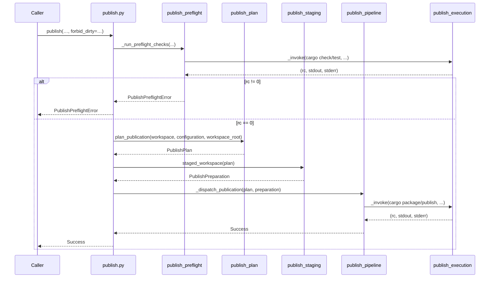
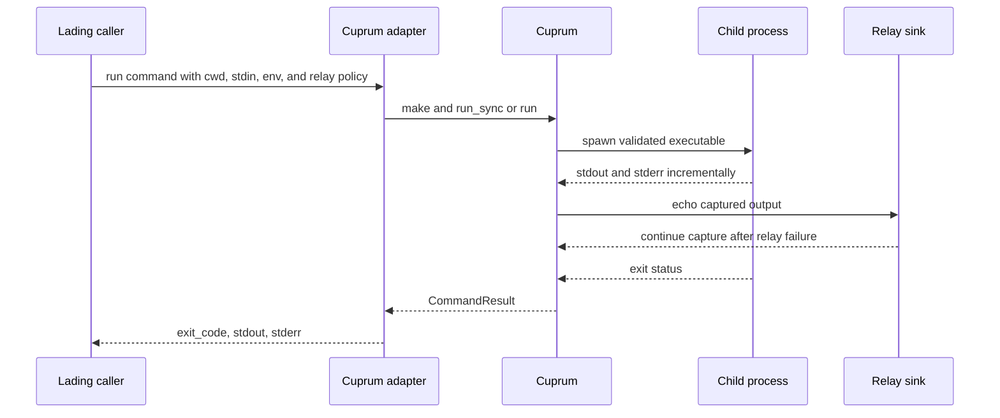

# Design Document: Lading Crate Management Tool

Version: 1.0\
Status: Proposed\
Date: 05 October 2025

## 1. Introduction

### 1.1. Purpose

This document specifies the design for a generalized, configuration-driven
Python utility named `lading`. This tool will streamline versioning and
publication workflows for arbitrary Rust workspaces. It is intended to
supersede and replace the existing, repository-specific `bump_version.py` and
`run_publish_check.py` scripts, abstracting their core logic into a reusable
and robust command-line application.

### 1.2. Scope

The project encompasses the following key deliverables:

1. A unified command-line interface (CLI) tool, `lading`, built with
   `cyclopts`, providing `bump` and `publish` subcommands.
2. A single, unified TOML configuration file, `lading.toml`, to define
   workspace-specific behaviours, minimizing the need for command-line
   arguments.
3. A workspace discovery mechanism that infers the dependency graph, crate
   locations, and publication order by parsing the output of `cargo metadata`.
4. A `bump` command to propagate version changes across the workspace,
   including `Cargo.toml` files for both the workspace and individual crates,
   and to synchronize documentation files.
5. A `publish` command to execute pre-publish checks and publish crates to a
   registry in the correct topological order, with support for both dry-run and
   live modes.
6. Support for the `readme.workspace = true` manifest key, ensuring the
   workspace's `README.md` is adopted into member crates during version bumps
   before packaging.

### 1.3. Goals

- **Decoupling:** Eliminate hardcoded paths, crate names, and
  repository-specific assumptions from the tooling.
- **Generalization:** Create a tool that can be applied to any Rust workspace
  with minimal configuration.
- **Automation:** Reduce manual effort and the risk of human error in release
  processes.
- **Configuration over Code:** Favour declarative configuration in
  `lading.toml` over imperative logic within the tool itself.
- **Clarity and Maintainability:** Establish a clean, well-tested Python
  codebase that is easy to understand and extend.

### 1.4. Current coupling

#### `run_publish_check.py`

- The workflow is driven by the statically defined
  `PUBLISHABLE_CRATES` tuple imported from `publish_workspace_members`, which
  hard-codes the crate list and release ordering for this repository.
- Crate directories are resolved under `<workspace>/crates/<name>`, which only
  matches the current workspace layout and fails for workspaces that colocate
  crates elsewhere.
- Live publish commands and the locked publish variant are keyed off concrete
  crate names, making the publish pipeline unusable when the workspace contains
  a different set of packages.
- The dry-run mode packages one crate and checks others based on crate names,
  which will not hold in a generic workspace.

#### `bump_version.py`

- Member version updates assume that `ortho_config` should bump
  `ortho_config_macros` together, coupling the script to rstest-bdd-specific
  crates.
- Documentation updates only rewrite TOML fences that reference the
  `ortho_config` dependency and only touch `README.md` and
  `docs/users-guide.md`, missing other files in a different workspace layout.
- The script derives the workspace root as two directories above the script,
  preventing reuse when the tools are vendored into another project or invoked
  against a different repository.

## 2. Core Components

### 2.1. The `lading` Command-Line Interface

The primary user interaction point will be the `lading` CLI. It will be
implemented using the `cyclopts` library to provide a modern, type-annotated,
and environment-aware interface.

The structure will be as follows:

```shell
lading [--workspace-root <path>] <subcommand> [options]
```

- `--workspace-root`: An optional global flag to specify the path to the Rust
  workspace root. If omitted, it defaults to the current working directory.
- **Subcommands:**

- `bump`: Manages version bumping.
- `publish`: Manages the publication process.

#### Implementation notes (Step 1.1)

- The initial CLI scaffolding lives in `lading/cli.py` and exposes a
  `main()` entry point alongside the `cyclopts.App` instance. Packaging wires
  this entry point through a `lading` console script for ergonomic execution.
- `--workspace-root` is implemented as a global flag that can be positioned
  before or after the subcommand. The bootstrapper removes the flag from the
  argument list, normalizes it via the shared
  `lading.utils.normalize_workspace_root` helper (implemented with
  `pathlib.Path` alone), and stores the resolved path in the
  `LADING_WORKSPACE_ROOT` environment variable so that Cyclopts can hydrate
  per-command options without bespoke parsing hooks.
- Subcommands currently dispatch to placeholder implementations that return a
  human-readable acknowledgement. The CLI prints these messages to aid smoke
  testing while we build out real behaviours in later roadmap steps.
- Behavioural coverage uses `pytest-bdd` with `cmd-mox` spies to exercise the
  CLI through an actual `python -m lading.cli` invocation. This ensures the
  scaffolding works end-to-end, not just through direct function calls.
- Configuration loading is centralized in `lading/config.py`. The module builds
  a `cyclopts.config.Toml` loader anchored at the workspace root, validates the
  resulting data with frozen dataclasses, and exposes a context manager so that
  downstream code can access the active configuration without passing it
  through every call. The CLI sets up this context before dispatching a
  subcommand and falls back to on-demand loading when commands are invoked
  programmatically.

### 2.2. Configuration: `lading.toml`

A `lading.toml` file located at the workspace root defines the tool's
behaviour. When the file is absent the CLI treats it as an empty document and
runs with the default configuration, so workspaces can opt in to overrides
incrementally. The design prioritizes inference to keep this file as minimal as
possible.

**Schema Definition:**

```toml
# lading.toml

# `bump` table: Configuration for the 'bump' command.
[bump]
# A list of crate names to exclude from the version bump process.
# The tool will infer all publishable crates by default and apply
# version bump to these.
# exclude = []

# `publish` table: Configuration for the 'publish' command.
[publish]
# A list of crate names to exclude from the publishing process.
# Useful for examples, internal tools, or private crates within the workspace.
# The tool will infer all publishable crates by default.
# exclude = []

# Optional explicit ordering for publication. If not specified, the tool
# will determine the order topologically from the dependency graph.
# This should only be used to resolve ambiguity or enforce a specific sequence.
# Crate names listed here must be valid members of the workspace.
# order = ["crate-a", "crate-b"]

# Strategy for stripping [patch.crates-io] directives from Cargo.toml during
# publication. This is often necessary to ensure the registry uses published
# versions of workspace dependencies instead of local path overrides.
#
# Possible values:
# - "all": The entire [patch.crates-io] section is removed from the temporary
#   workspace manifest before any checks are run.
# - "per-crate": Before publishing each crate, its specific entry is removed
#   from the [patch.crates-io] section. This allows subsequent crates in the
#   publish order to still resolve local paths.
# - false: No patches are stripped.
#
# If unset, the tool defaults to "all" for dry runs and "per-crate" for live
# runs.
strip_patches = "per-crate"
```

Implementation detail: the publish command rewrites the staged workspace
`Cargo.toml` immediately after cloning the workspace tree. The helper loads the
manifest with `tomlkit` so formatting and comments survive the transformation
and either removes the entire `[patch.crates-io]` table when the strategy is
`"all"` or deletes only the entries whose crate names appear in the publish
plan when using `"per-crate"`. Setting the value to `false` leaves the patch
table untouched so bespoke overrides (for example, third-party forks) remain
available during packaging. Any parse errors or missing manifests surface as
`PublishPreparationError` to keep the staging workflow predictable.

#### Publish data flow

The publish data flow shows how the publish command coordinates crate planning,
workspace staging, manifest preparation, and command execution. The coordinator
delegates live and dry-run sequencing to `publish_pipeline`, which uses the
`publish_execution` command adapter through an injected runner.


```mermaid
graph TD
    A["CLI: lading publish"] --> B["Module: lading.commands.publish"]
    B --> C["Module: lading.commands.publish_plan (publish_plan.py)"]
    C --> C1["Build PublishPlan with publishable_names"]
    B --> S["Module: lading.commands.publish_staging (publish_staging.py)"]
    S --> S1["Copy workspace and resolve staged crate paths"]
    B --> D["Module: lading.commands.publish_manifest (publish_manifest.py)"]
    D --> D1["_apply_strip_patch_strategy(staging_root, plan, strategy)"]
    D1 --> D2{"strip_patches configuration"}
    D2 -->|"False"| E["Skip manifest modification"]
    D2 -->|"all"| F["Remove all patch.crates-io entries"]
    D2 -->|"per-crate"| G["Remove crates-io entries for plan.publishable_names"]
    F --> H["Cleanup empty patch tables and write Cargo.toml"]
    G --> H
    H --> I["Updated staged manifest used for publish"]

    B --> P["Module: lading.commands.publish_pipeline (publish_pipeline.py)"]
    P --> P1["Dispatch live or dry-run package/publish pipeline"]
    P --> J["Module: lading.commands.publish_execution (publish_execution.py)"]
    J --> K["_invoke: subprocess execution with error adaptation"]
    J --> K2["_run_timed_cargo: per-crate timing and duration metric"]
    P --> L["Module: lading.commands.publish_sccache (publish_sccache.py)"]
    L --> L1["SccacheSession: query lifecycle and side effects"]
    L --> R["Module: lading.commands.publish_sccache_report (publish_sccache_report.py)"]
    R --> R1["SccacheLedger, formatting, atomic report writing"]
    L --> M["Module: lading.commands.publish_sccache_stats"]
    M --> M1["detect_wrapper, query_snapshot, parse_counters"]
    B --> N["Module: lading.commands.publish_preflight (publish_preflight.py)"]
    N --> O["Run pre-flight checks before publication dispatch"]
```

_Figure 1: Publish data flow from planning and staging through Cargo execution._

### 2.3. Workspace Discovery and Model

The tool's internal representation of the workspace is critical for its
operation. This model will be constructed at runtime by executing
`cargo metadata --format-version 1` and parsing its JSON output. This approach
is superior to manual TOML parsing as it correctly handles path dependencies,
build scripts, and complex workspace configurations.

#### Implementation notes (Step 1.2)

- Workspace discovery is anchored in `lading.workspace.metadata`. The module
  invokes `cargo metadata --format-version 1` through the active
  `CommandRunner`, normalizing the workspace root via
  `lading.utils.normalize_workspace_root` before invoking the command.
- Failures to locate the `cargo` executable raise
  `CargoExecutableNotFoundError`; non-zero exit codes raise
  `CargoMetadataInvocationError`; malformed JSON payloads raise
  `CargoMetadataParseError`. Each derives from `CargoMetadataError`, giving
  higher layers a single umbrella type while preserving detail for logging.
- The wrapper returns the parsed JSON mapping directly. Later roadmap steps
  will build dedicated models on top of this structure without re-running the
  command or reparsing JSON.
- `lading.workspace.models` defines the `WorkspaceGraph`, `WorkspaceCrate`, and
  `WorkspaceDependency` types as `msgspec.Struct` instances so that workspace
  data is immutable and efficiently serialized.
- `build_workspace_graph` reads each crate manifest with `tomlkit` to detect
  `readme.workspace = true` entries while preserving formatting for later
  round-tripping.
- `load_workspace` constructs the graph once per CLI invocation and passes it
  to command handlers, allowing them to share discovery results without
  re-running `cargo metadata`.

The discovery process will populate an internal data structure representing the
workspace graph, containing:

- **Workspace Root:** The absolute path to the workspace directory.
- **Crate List:** A collection of all crates, each containing:

- `name`: The crate name (e.g., `my-crate`).
- `version`: The current version string.
- `path`: The absolute path to the crate's root directory.
- `manifest_path`: The absolute path to the crate's `Cargo.toml`.
- `publish`: A boolean indicating if the crate is intended for publication
  (derived from `package.publish` in `Cargo.toml`).
- `dependencies`: A list of its dependencies within the workspace. Each entry
  retains both the canonical crate name and the manifest key, so renamed
  dependencies (e.g., `alpha-core = { package = "alpha" }`) can be matched back
  to the correct manifest entry when updating requirements.
- `readme_is_workspace`: A boolean flag derived from checking if
  `package.readme.workspace` is `true`.

This internal graph enables reliable dependency resolution and topological
sorting for the `publish` command.

## 3. `bump` Subcommand Design

The `bump` command will synchronize versions across the workspace.

**Command Signature:**

```shell
lading bump <new_version> [--dry-run]
```

- `<new_version>`: The new semantic version string (e.g., `1.2.3`). This is a
  required argument.
- `--dry-run`: If present, the command will report all changes it would make
  without writing to any files.

**Execution Flow:**

1. **Discover Workspace:** Build the internal workspace model.
2. **Update Workspace **`Cargo.toml`**:** Set `workspace.package.version` to
   `<new_version>`.
3. **Update Member Crates:** For each crate in the workspace (not just
   publishable ones):

    - Update `package.version` in its `Cargo.toml`.
    - Iterate through its `[dependencies]`, `[dev-dependencies]`, and
      `[build-dependencies]`. If a dependency is a workspace member, update its
      version string to match `<new_version>`, preserving any existing version
      operators (e.g., `^`, `~`). This prevents version drift between internal
      crates.

4. **Handle Workspace READMEs:** For each crate where `readme_is_workspace` is
   `true`:

    - Copy the `README.md` file from the workspace root to the crate's
      directory, rewriting relative Markdown links for the crate directory and
      overwriting any existing file when content changes. This action is part
      of the versioning workflow, so the result can be reviewed and committed
      before publishing.

5. **Update Documentation Files:** _(deferred to Step 2.2)_

    - Introduce configuration-driven glob patterns for documentation files.
    - For each matching file, scan for TOML fenced code blocks (three backticks
      with the language tag "toml").
    - Within each fence, parse the content and update the version of any
      dependency that is also a workspace member to `<new_version>`. This
      replaces the previous hardcoded logic.

6. **Report Changes:** Output a summary of all files that were (or would be)
   modified.

### Implementation notes (Step 2.1)

- Manifest rewrites use `tomlkit` so comments and formatting remain intact. The
  implementation updates both `[package]` and `[workspace.package]` sections in
  the workspace manifest when present.
- `bump.exclude` is respected when iterating workspace crates. Any crate name
  listed in the configuration keeps its existing `package.version` value during
  the update pass.
- Dependency requirements referencing workspace members are rewritten using the
  workspace graph. For each crate we map dependencies to their `[dependencies]`,
  `[dev-dependencies]`, or `[build-dependencies]` sections and update the
  requirement string only when the target crate's version changes. Leading
  operators such as `^` and `~` are preserved so caret and tilde semantics
  continue to apply.
- Crates excluded via `bump.exclude` still have their dependency requirements
  refreshed when they point at bumped members. This keeps the workspace graph
  consistent without forcing the excluded crate to change its own version.
- The command reports a concise summary that enumerates every manifest path on
  its own line. The live mode prefix is `Updated version to <version> in …`,
  while dry runs use `Dry run; would update version to <version> in …`. When no
  manifest requires changes the CLI reports:
  `No manifest changes required; all versions already <version>.`
- A `--dry-run` flag bypasses file writes entirely while still computing the
  manifest diff. This allows automation to preview the impact of a bump without
  touching the workspace.
- Version arguments are validated at the CLI layer before the workspace model
  loads. Invalid formats raise a user-facing error without touching the
  filesystem, while values may include optional pre-release and build metadata.
- The legacy `bump.doc_files` configuration knob has been retired until
  documentation rewriting arrives in Step 2.2 to avoid implying unsupported
  behaviour.

### Implementation notes (Step 2.2)

- `bump.documentation.globs` accepts glob patterns relative to the workspace
  root. Each pattern expands to a list of Markdown files that should have their
  TOML fences rewritten during a bump.
- Markdown fences are parsed with `markdown-it-py` so indentation and
  language info strings are preserved. The fence bodies are parsed with
  `tomlkit`, updating `[package]`, `[workspace.package]`, and dependency
  entries that reference workspace crates. Existing requirement operators and
  inline trivia remain intact.
- The publish workflow stages a clean workspace copy in a temporary directory
  before packaging. The staging directory must live outside the source tree to
  avoid recursive copies. Crates that opt into `readme.workspace = true` must
  already have adopted READMEs from the preceding `bump` workflow, so operators
  can review the packaged assets before publishing. Symbolic links remain links
  by default to avoid cloning large external trees; callers can opt into
  dereferencing by disabling `preserve_symlinks` via `PublishOptions`. Likewise,
  `PublishOptions(cleanup=True)` registers an `atexit` hook that removes the
  temporary build directory after the process exits.
- Documentation rewrites honour `--dry-run`; the command reports the files but
  skips writing to disk. The CLI summary now reports both manifest and
  documentation counts, and documentation entries are suffixed with
  `(documentation)` for clarity.

### Lockfile repository port (bump side)

The bump domain reaches Cargo lockfile projection and regeneration through a
`LockfileRepository` port defined in `lading.commands.bump_lockfiles`.
`CargoLockfileRepository` is the cargo- and git-backed adapter; it is
constructed with an optional `CommandRunner`, merges configured manifests with
manifests discovered from tracked lockfiles, and delegates projection and
regeneration through the `lading.commands.bump_lockfiles` compatibility façade.
The façade keeps the port, adapter, and established public imports in one
boundary while cohesive helper modules hold the implementation:
`bump_lockfile_manifests` merges configured and discovered manifests,
`bump_lockfile_paths` validates manifests and projects lockfile paths, and
`bump_lockfile_regeneration` invokes Cargo and aggregates failures.
`BumpOptions.lockfile_repository` is the injection point; when `None`, bump
substitutes `CargoLockfileRepository` bound to the default subprocess runner,
and the CLI binds the adapter at the composition root. This keeps the bump
domain free of a raw `CommandRunner` (issue #82).

## 4. `publish` Subcommand Design

The `publish` command orchestrates the publication of crates to the designated
registry.

**Command Signature:**

```shell
lading publish [--live] [--forbid-dirty] [--keep-staging] [--sccache-stats]
               [--sccache-stats-json PATH]
```

- `--live`: By default, the command simulates the entire process, including
  `cargo package` and `cargo publish --dry-run`, without uploading to the
  registry. Specifying `--live` takes the process to completion by packaging
  and publishing each crate before moving to the next crate in the publish
  order.
- `--forbid-dirty`: Require a clean working tree before running the pre-flight
  checks. When omitted the git status guard is skipped so that developers can
  iterate on pending changes.
- `--keep-staging`: Retain the staged workspace copy after publication and log
  where it is, instead of removing it. The copy is the whole workspace plus its
  verify build, so retaining it is the exception and the flag names the
  exception; `LADING_KEEP_STAGING` supplies its default. Removing the copy is
  otherwise unconditional, covering success, failure, interruption and
  `SIGTERM` (issue #269).
- `--skip-preflight` / `--no-skip-preflight`: Skip, or reinstate, the
  compilation-heavy part of the pre-flight for callers that have already
  verified the workspace. The flag overrides `[preflight] skip` in both
  directions and takes its default from `LADING_SKIP_PREFLIGHT`, so a CI
  workflow can suppress the repeat without editing the command line. The
  lockfile guard and the opt-in working-tree guard are unaffected.
- `--sccache-stats` / `--sccache-stats-json PATH`: Opt-in compiler-cache
  instrumentation (issue #252). Lading queries the sccache binary named by
  `RUSTC_WRAPPER` for a baseline after pre-flight and again after every
  per-crate cargo invocation, logs one bounded line per crate with the counters
  attributable to it, and optionally writes a JSON report. Snapshots are
  differenced rather than zeroed so the caller's own job-wide report keeps its
  meaning, and every failure is a WARNING: measurement never fails a release
  rehearsal. The environment variables `LADING_SCCACHE_STATS` and
  `LADING_SCCACHE_STATS_JSON` supply defaults so CI can enable it without
  editing a Makefile.

**Execution Flow:**

1. **Execute pre-flight checks:** Before publishing, run a series of checks in
   the workspace itself to ensure integrity:

    - Run `cargo check --all-targets` for the entire workspace.
    - Run `cargo test --all-targets` for the entire workspace.

    Implementation detail: the command executes both cargo subcommands via
    `plumbum` directly in the workspace root so that any relative path
    dependencies remain accessible. Build artefacts are isolated by exporting a
    per-run target directory created with `tempfile.TemporaryDirectory`; the
    directory (and any compiled artefacts) is discarded automatically once the
    checks complete. A preceding `git status --porcelain` verifies that the
    working tree is clean only when operators pass `--forbid-dirty`. Skipping
    the flag leaves the guard disabled so local experiments can reuse the same
    entrypoint. For testing and controlled environments the helper honours the
    `LADING_USE_CMD_MOX_STUB` environment variable: when set to a truthy value
    (`1`, `true`, `yes`, or `on`) the pre-flight invocations contact the
    cmd-mox IPC server instead of spawning real processes. Each subcommand is
    encoded as `cargo::<name>` so that behavioural tests can record
    expectations without interfering with the `cargo metadata` stub used
    elsewhere.

    The configuration layer exposes a `[preflight]` table so workspaces can
    selectively skip crates during the `cargo test` pre-flight run. Entries in
    `preflight.test_exclude` translate directly into `--exclude <crate>` flags
    passed to the cargo invocation, letting release pipelines avoid expensive
    cucumber suites or other integration-heavy members while still validating
    the remaining crates. Setting `preflight.unit_tests_only = true` narrows
    the command to library and binary targets by appending `--lib --bins`,
    providing a lightweight alternative when integration and example tests are
    not required for release validation. Additional hooks support compiletest
    workflows:

    - `preflight.aux_build` – a list of auxiliary commands that run before the
      cargo invocations so rule crates can precompile UI helpers.
    - `preflight.compiletest_extern` – a mapping of crate names to artefact
      paths that Lading injects into `RUSTFLAGS` as `--extern` arguments for
      the cargo test invocation.
    - `preflight.env` – a table of environment overrides applied to every
      pre-flight command so localization knobs such as `DYLINT_LOCALE` stay in
      sync with the surrounding harness.
    - `preflight.stderr_tail_lines` – the number of lines tailed from
      compiletest `*.stderr` files when cargo test fails, exposing the debug
      diff directly in the CLI output.
    - `preflight.skip` – suppress the auxiliary builds and the cargo
      check/test pair outright. A caller that has already built and tested the
      same commit otherwise pays for the whole suite twice; measured on a warm
      cache, the repeat was 883 of the 936 seconds a Linux publish step took.
      The lockfile guard still runs, and so does the working-tree guard when
      `--forbid-dirty` opts into it, because neither repeats the caller's work
      and both still decide whether the publication would be correct.
      `lading publish` logs the setting, flag, or environment variable that
      requested the skip, and records the `publish.preflight` counter and
      `publish.preflight.duration` observation for it.

    Any `PublishPreflightError` aborts execution before `plan_publication`,
    `publish_staging.staged_workspace`, or
    `publish_pipeline._dispatch_publication` run.

2. **Discover Workspace:** Build the internal workspace model.
3. **Determine Publishable Crates:**

    - Filter the crate list to include only those where `publish` is not
      `false`.
    - Remove any crates listed in `publish.exclude` from `lading.toml`.
    - Record crates skipped by manifest settings and configuration so the CLI
      can explain how the plan was derived. Report any configuration exclusions
      that do not match workspace crates to help users prune stale entries.

4. **Determine Publish Order:**

    - If `publish.order` is defined in `lading.toml`, validate that it contains
      all publishable crates and use this order.
    - If `publish.order` is not defined, perform a topological sort on the
      dependency graph of publishable crates to generate the correct
      publication sequence. If the graph contains cycles, the command will
      abort with an error.

Implementation note: the planner now performs a deterministic topological sort
using Kahn's algorithm with a lexicographically ordered queue so that parallel
branches remain stable across runs. The resulting `PublishPlan` raises a
`PublishPlanError` when a cycle prevents ordering, surfacing the crates
involved to the operator. When `publish.order` is configured the planner
validates that every publishable crate appears exactly once and that no unknown
names are listed before returning the user-specified order.

<!-- markdownlint-disable-next-line MD029 -->
1. **Stage the workspace and prepare its manifest:**
   `publish_staging.staged_workspace` creates an isolated workspace copy that
   is removed when publication ends. Within that staged workspace, determine
   the patch stripping strategy based on the `publish.strip_patches`
   configuration value and the execution mode (`--live` versus the default
   dry-run mode).

    - If strip_patches is "all" (or is unset and this is the default dry-run
      mode), remove the entire [patch.crates-io] section from the Cargo.toml.

### Lockfile inspection repository port (publish side)

The publish pre-flight domain reaches tracked-lockfile discovery and freshness
validation through a `LockfileInspectionRepository` port defined in
`lading.commands.lockfile_repository`, alongside its git- and cargo-backed
adapter `CargoLockfileInspectionRepository`; it binds a `CommandRunner` and the
optional pre-flight base environment, applying that environment to invocations
that do not supply their own. `publish_preflight._run_preflight_checks` is the
composition root: it constructs the adapter and passes it to the domain helpers
`_collect_stale_lockfiles` and `_validate_lockfile_freshness` in
`publish_lockfile_preflight.py`, which depend only on the port. Together with
the bump-side `LockfileRepository`, the two ports keep VCS, filesystem, and
cargo execution concerns out of the lockfile domain logic (issue #82).

`_collect_stale_lockfiles` deliberately classifies every tracked `Cargo.lock`
rather than short-circuiting on the first stale one (issue #83). When stale
lockfiles are found, `_build_stale_lockfile_message` composes a diagnostic
message that lists each offending lockfile alongside its own
`cargo generate-lockfile --manifest-path ...` repair command;
`_validate_lockfile_freshness` then raises it as a `PublishPreflightError`, so
the operator can remediate the whole workspace in a single pass rather than
re-running the pre-flight once per lockfile. Only unexpected failures from
`cargo metadata --locked` — those not attributable to a stale lockfile — raise
immediately on first occurrence, leaving the aggregation path unaffected.

### Publish Preflight Sequence

The preflight sequence diagram illustrates the pre-flight checks that run
before crate publication. Auxiliary build commands (if configured) execute
first, followed by cargo check and cargo test with environment overrides
applied. Preflight failures abort the publish workflow; success advances to
crate-by-crate publishing.


```mermaid
sequenceDiagram
    participant Caller
    participant publish.py
    participant publish_preflight
    participant publish_plan
    participant publish_staging
    participant publish_pipeline
    participant publish_execution

    Caller->>publish.py: publish(…, forbid_dirty=…)
    publish.py->>publish_preflight: _run_preflight_checks(...)
    publish_preflight->>publish_execution: _invoke(cargo check/test, ...)
    publish_execution-->>publish_preflight: (rc, stdout, stderr)
    alt rc != 0
        publish_preflight-->>publish.py: PublishPreflightError
        publish.py-->>Caller: PublishPreflightError
    else rc == 0
        publish.py->>publish_plan: plan_publication(workspace, configuration, workspace_root)
        publish_plan-->>publish.py: PublishPlan
        publish.py->>publish_staging: staged_workspace(plan)
        publish_staging-->>publish.py: PublishPreparation
        publish.py->>publish_pipeline: _dispatch_publication(plan, preparation)
        publish_pipeline->>publish_execution: _invoke(cargo package/publish, ...)
        publish_execution-->>publish_pipeline: (rc, stdout, stderr)
        publish_pipeline-->>publish.py: Success
        publish.py-->>Caller: Success
    end
```

_Figure 2: Publish pre-flight sequence from checks through crate publication._

### Publishing iteration

1. **Prepare staged workspace:** Apply patch stripping in the temporary
   workspace before invoking Cargo for individual crates.

    - **Patch Handling (per-crate)**: If strip_patches is "per-crate" (or is
      unset and this is a live run), remove the specific patch entry for the
      current crate from the Cargo.toml within the working tree snapshot being
      prepared for packaging.
    - **README Handling:** If the crate has `readme.workspace = true`, rely on
      the README adopted during `lading bump`; publish does not copy README
      files during staging.

2. **Dispatch Cargo operations:** The publishing mode determines how Cargo is
   invoked for the planned crate order.

    - **Dry-run:** Run `cargo package` for every publishable crate first, then
      run `cargo publish --dry-run` for every crate. This validates the full
      batch without uploading anything.
    - **Live:** For each crate, run `cargo package` and then `cargo publish`
      before moving to the next crate. This makes a newly uploaded earlier
      crate visible to later crates that depend on it in the same release
      train.

    Every per-crate cargo invocation streams its output as it runs and is
    timed; the start and success log lines carry the crate's `n/total`
    position, the success line reports the elapsed seconds, and the duration
    is recorded under the `publish.cargo.duration` metric with `subcommand`
    and `crate` labels, so a slow packaged build is attributable to one crate
    (issue #251). Commands whose stdout is a document rather than progress,
    such as the `cargo metadata --locked` freshness probe, are captured
    without being mirrored to the console: a multi-megabyte single line
    breaks CI log capture and hides everything that follows it.

    When the registry reports that a crate version already exists, Lading logs
    a warning and continues to the next crate instead of aborting the
    publication loop. Live publishing is not transactional: if a later crate
    fails, any earlier successful uploads remain on crates.io and are skipped
    on a subsequent run.

## 4a. `clean` Subcommand Design

The `clean` command removes staging copies that earlier releases left behind.
Publishes no longer leak them (issue #269), but a long-lived host already holds
one per past run.

**Command Signature:**

```shell
lading clean [--location PATH] [--remove]
```

- `--location PATH`: Directory to search. Defaults to the system temporary
  directory, which is where a publish stages unless `TMPDIR` says otherwise.
- `--remove`: Delete what is found. Reporting is the default, and the flag
  names the exception, the same shape as `--keep-staging` on `publish`.

This is the only command that deletes directories the user did not name, so its
scope is the design. It considers the immediate children of one directory and
does not recurse; it matches names by `publish_staging.STAGING_PREFIX`,
imported rather than repeated so the two cannot drift; and it refuses symbolic
links rather than following them, so nothing outside the searched directory can
be reached. A removal that fails is logged and the sweep continues, so one busy
tree does not abandon the rest.

The report names the bytes each tree holds and their total, because reclaiming
space is the reason to run it.

### Cross-process staging claim

A staged tree left behind by a still-running publish is indistinguishable, by
name and shape, from one abandoned by a release that never cleaned up: both
carry `STAGING_PREFIX` and both are ordinary directories. The publish that owns
a tree runs in a different process from `clean`, so the in-memory
`_ACTIVE_STAGING_ROOTS` set that guards termination cleanup within one process
cannot answer for it. Crossing that process boundary is what the claim exists
to do.

Every automatically created staging tree therefore carries a
`.lading-staging-lock` file, which its publisher opens and holds under an
exclusive, non-blocking lock for the tree's whole life: `fcntl.flock` on POSIX,
`msvcrt.locking` on Windows, both behind the single `staging_lock` module so
callers do not choose a platform.

The claim is a kernel-held lock rather than a marker file recording a process
identifier, because a marker fails in both directions that matter here. A
reused process identifier can make a dead owner look alive, and a publish
killed outright leaves its marker behind, making the tree permanently
unremovable — the exact leftover `clean` exists to sweep. A kernel lock avoids
both: it is dropped when its holder dies, however it dies, so there is no stale
state to reconcile and nothing to time out.

The design has to close the gap between asking and deleting, so `clean` does
not check the claim and then remove the tree: `hold_for_removal` holds the
claim across the `shutil.rmtree` call itself. A publish could claim the tree in
the interval between a check and a delete, so the claim must span the whole
removal, not merely precede it.

Windows cannot honour that shape directly: an open handle inside a directory
stops that directory being deleted there, so the claim cannot be held while the
tree is removed on that platform. The same rule, though, is what keeps a live
tree safe: the publisher's own open handle makes the removal itself fail rather
than succeed, so an in-use tree is never deleted there. The claim turns that
failure into an orderly skip. There is deliberately no separate "is this tree
in use" query: probing a kernel lock means taking it, so such a query would
mutate while presenting as a read, and its answer would be stale before the
caller could act on it. `hold_for_removal` is the one way to ask, and it
returns the answer together with the claim that keeps it true.

The lock is advisory, a courtesy rather than a guarantee: `claim` returns
whether it succeeded, and a filesystem that refuses to lock does not stop a
publish, only leaves it to log a warning that a concurrent
`lading clean --remove` could take its tree. A publish that retains its staged
tree still releases the claim once its block ends, since no publish is left
reading it. A tree with no lock file predates the mechanism and stays
removable, and deleting the lock file by hand defeats the claim entirely.

One window remains open by construction: `_normalize_build_directory` creates
the tree with `mkdtemp` and only calls `claim` afterwards, because a directory
cannot be created already locked. Closing that gap would require the lock to
live outside the tree it protects, which would orphan lock files on removal and
change what an absent lock file means.

## 5. Refactoring and Project Structure

The legacy repository-specific scripts have been consolidated into the `lading`
package structure.

**Proposed Directory Structure:**

```plaintext
lading/
  ├── __init__.py
  ├── cli.py  # Cyclopts app definition and command wiring
  ├── commands/
  │   ├── __init__.py
  │   ├── bump.py  # Logic for the `bump` subcommand
  │   └── publish.py  # Logic for the `publish` subcommand
  ├── config.py  # Frozen dataclasses for `lading.toml`
  ├── utils/
  │   ├── __init__.py
  │   └── path.py  # Filesystem helpers such as `normalize_workspace_root`
  └── workspace/
      ├── __init__.py
      ├── metadata.py  # `cargo metadata` invocation and parsing
      └── models.py  # Workspace graph and manifest helpers

tests/
  ├── conftest.py
  ├── fixtures/
  │   └── simple_workspace/
  │       ├── Cargo.toml
  │       └── lading.toml
  └── test_*.py
```

This structure separates concerns, improves testability, and establishes a
clear architecture for future development.

## 6. Testing Strategy

A robust testing strategy is essential for a tool that modifies source files
and performs releases.

- **Unit Tests:** Each module (`config.py`, `workspace/metadata.py`,
  `workspace/models.py`, command helpers) will have comprehensive unit tests.
  Logic within the `bump` and `publish` commands will be unit-tested with
  mocked filesystem and subprocess calls. Where behaviour is identical across
  inputs (for example, ensuring metadata decoding handles both text and byte
  streams) the suite will rely on parametrized tests to avoid duplication while
  exercising each variant.
- **Integration Tests:** The CLI itself (`cli.py`) will be tested using
  `cyclopts.testing.invoke`. These tests will run against mock workspaces
  defined in `tests/fixtures/` to verify command-line parsing, configuration
  loading, and the orchestration of different modules.
- **End-to-End Tests:** A small suite of end-to-end tests will operate on
  temporary Git repositories. These tests will initialize a Rust workspace,
  commit a `lading.toml`, and then execute `lading bump` and
  `lading publish --dry-run`, asserting that the files are correctly modified
  and the `cargo` commands are executed in the right sequence.

This multi-layered approach will ensure correctness from the lowest-level
utilities to the highest-level user-facing commands.

### Phase 4 testing updates

- Introduced `pytest-cov` as a development dependency, so coverage can be
  reported via `uv run pytest --cov` without additional tooling. Phase 4 sets a
  floor of >90% line coverage for new modules; focused unit tests now exercise
  configuration validation edges, publish manifest handling, cmd-mox IPC
  fallback mechanisms, and workspace model error paths to keep defensive code
  paths observable.
- End-to-end behavioural coverage now lives under `tests/e2e/` and executes
  the CLI in a temporary Git repository. The suite uses real git operations
  (`git init`, `git commit`, `git status`) while stubbing `cargo` interactions
  via cmd-mox (`cargo metadata`, `cargo::check`, `cargo::test`,
  `cargo::package`, and `cargo::publish`) so that workflows can be validated
  without a Rust toolchain.
- cmd-mox remains the default mechanism for mocking external commands. Tests
  covering publish pre-flight and `cargo metadata` IPC use stubbed cmd-mox
  modules rather than spawning real processes, keeping suites deterministic
  while still traversing streaming/IPC code paths.

### Phase 4 documentation updates

- Added `docs/users-guide.md` as the primary end-user guide. It contains an
  installation guide, a tutorial, and a complete `lading.toml` reference.
- Added tests that assert the user guide documents every supported `lading.toml`
  option, so configuration schema changes cannot silently drift out of sync
  with the documentation.
- Standardized release builds via `make build-release`, which uses the
  repository-managed virtual environment (`uv run python -m build`) to produce
  `sdist` and `wheel` artefacts.

## 7. Command Execution Migration (Phase 5)

### 7.1. Rationale for Cuprum Adoption

Production command execution is standard-library `subprocess`, centralized in
one runner module: `lading/runtime/subprocess_runner.py` holds the sole
`subprocess.Popen` call, inside `_spawn_process`, and exposes
`subprocess_runner` as its public entry point, which delegates to
`invoke_via_subprocess`. Plumbum survives only in two end-to-end test helpers,
`tests/e2e/helpers/git_helpers.py` and
`tests/e2e/helpers/e2e_steps_helpers.py`; no module under `lading/` imports it.
`lading/utils/path.py` is already pure pathlib. Lading's logging of external
commands is established rather than ad hoc: `log_command_invocation` in
`lading/utils/process.py` sources exactly one INFO record per external command
invocation, plus a DEBUG record with the redacted environment diff.
[Cuprum](https://github.com/leynos/cuprum/) offers the following advantages as
additions to, or replacements for, that arrangement:

- **Security-first design**: Allowlist-based program registration adds
  enforcement to the staged catalogue; unknown executables raise
  `UnknownProgramError` rather than silently executing arbitrary commands.
- **Unified API**: Both synchronous and asynchronous execution through
  `run_sync()` and `run()`, replacing the split between plumbum in the
  end-to-end helpers and `subprocess` in production.
- **Built-in observability**: Hooks and structured events integrate naturally
  with logging without custom wrappers, complementing the existing
  single-invocation log rather than replacing it.
- **Pipeline composition**: Native support for command pipelines via the `|`
  operator, matching plumbum's ergonomics while adding safety guarantees.
- **Typed command building**: `sh.make()` constructs `SafeCmd` instances from
  curated programs, with keyword arguments transformed into `--flag=value`
  format automatically.

The rationale is bounded by §1 of the
[beta adoption assessment](cuprum-v0-2-0-beta1-adoption-assessment.md#1-recommendation-and-scope),
which records that only the catalogue, the pathlib conversion, and the
source-level assessment were complete when it was written. Its §1.1 now carries
a follow-up recording that the published beta has since been selected and
validated on both dependency paths by step 5.1.4, which also migrated the
release uploader. The bulk of the migration -- the production backend and every
other caller -- remains unimplemented and belongs to 5.2.

### 7.2. Migration Scope

The migration covers six areas:

1. **`lading/runtime/subprocess_runner.py`**: Replace the spawning backend
   behind the existing `lading/runtime/runner.py` `CommandRunner` protocol. The
   module's public `subprocess_runner` entry point and the `subprocess.Popen`
   call inside `_spawn_process` form the only production process-spawning
   boundary, so replacing that backend is the primary migration point.
   Preserving real-time stream relay through the same boundary is what makes it
   the most complex one.
2. **Production callers**: Route every remaining caller through the selected
   adapter. `lading/workspace/metadata.py` already builds a plain argument
   vector and delegates to an injected `CommandRunner`, so it is a caller to
   migrate rather than a spawner. `lading/commands/publish_execution.py` also
   delegates to the production runner and owns error translation and per-crate
   duration timing. The `pathlib` conversion is already the finished part of
   the phase: `lading/utils/path.py` no longer depends on plumbum and carries
   no execution work.
3. **Real cmd-mox passthrough**: Route `lading/testing/cmd_mox_runner.py`
   through the same adapter while preserving IPC routing, cargo subcommand
   namespacing, real-command overrides, PATH filtering, and PWD handling.
4. **End-to-end test helpers**: Migrate both plumbum helpers,
   `tests/e2e/helpers/git_helpers.py` and
   `tests/e2e/helpers/e2e_steps_helpers.py`, preserving `GitCommandError`.
5. **Direct-subprocess test invocations**: Migrate the six test files that
   import `subprocess`: `tests/bdd/steps/test_common_steps.py`,
   `tests/e2e/test_upload_release_wheels_cli.py`,
   `tests/e2e/test_staging_cleanup_on_termination.py`,
   `tests/integration/test_cargo_shim_cli.py`,
   `tests/integration/test_lockfile_discovery.py`, and
   `tests/workflow_contracts/test_lint_target.py`.
6. **Release scripts**: The uploader's cuprum boundary now lives in
   `scripts/release_gh.py`, which holds the release catalogue, the `Program` for
   `gh`, and `run_gh`, the script's only process edge. It uses the beta forms
   -- `scoped(catalogue=RELEASE_CATALOGUE)` and
   `run_sync(output=RunOutputOptions(capture=True))` -- and was migrated in
   5.1.4 alongside the pin. `scripts/release_wheel_upload.py` keeps the upload
   logic and takes the runner as an injected `UploadRunner`, so the logic is
   testable without a process. Dependency-internal subprocess use and the cargo
   shim's `os.execvp` process replacement stay outside this phase.

The sequencing, dependencies, and per-task success criteria for this scope are
recorded in the roadmap's command execution modernization section, and the
streaming, catalogue, and compatibility details follow in §7.3, §7.4, and §7.5.

### 7.3. Catalogue Definition

A project catalogue registers allowed executables. The catalogue is defined in
`lading/utils/commands.py` using Cuprum's `ProgramCatalogue` and
`ProjectSettings`:

```python
from cuprum import Program, ProgramCatalogue, ProjectSettings

# Program objects for allowed executables
CARGO = Program("cargo")
GIT = Program("git")
# Queried for compiler-cache statistics by `lading publish --sccache-stats`;
# the binary invoked is the one RUSTC_WRAPPER names.
SCCACHE = Program("sccache")

# Project settings for the lading package
_LADING_PROJECT = ProjectSettings(
    name="lading",
    programs=(CARGO, GIT, SCCACHE),
    documentation_locations=("docs/lading-design.md#command-execution-migration",),
    noise_rules=(),
)

# Shared catalogue for all lading modules
LADING_CATALOGUE = ProgramCatalogue(projects=(_LADING_PROJECT,))
```

Command construction uses cuprum's scoped context manager, naming the catalogue
directly, and passes the same catalogue to `sh.make()`:

```python
from cuprum import RunOutputOptions, scoped, sh
from lading.utils.commands import CARGO, LADING_CATALOGUE

with scoped(catalogue=LADING_CATALOGUE):
    cargo_builder = sh.make(CARGO, catalogue=LADING_CATALOGUE)
    metadata = cargo_builder("metadata", "--format-version", "1")
    result = metadata.run_sync(output=RunOutputOptions(capture=True))
```

The catalogue is what the scope needs, because every `Program` it registers is
admissible. `ScopeConfig` remains available for the cases a catalogue cannot
express: a narrower allowlist than the catalogue carries, scope-level hooks, a
scope timeout, or an environment overlay.

Two call forms were removed before 0.2.0 and raise `TypeError`: the flat
`scoped(allowlist=...)` and `run_sync(capture=...)` keywords. Capture settings
now travel in a `RunOutputOptions` instance passed as `output=`.

#### Implementation Notes (Step 5.1)

- The catalogue is defined in `lading/utils/commands.py` and exported via
  `lading.utils.LADING_CATALOGUE` for convenient access across the codebase.
- `CARGO` and `GIT` program constants are also exported, enabling type-safe
  command construction without string literals.
- The `ProjectSettings` includes a reference to this design document section for
  discoverability when debugging catalogue-related issues.
- Unit tests verify catalogue construction, program registration, and
  `UnknownProgramError` handling for unregistered programs.
- Behaviour-driven development (BDD) scenarios document the expected behaviour
  for downstream consumers, including command construction within scoped
  contexts.

#### Implementation notes (Step 5.1.4)

Step 5.1.4 selects the published `cuprum==0.2.0b1` on both dependency paths and
migrates the call sites that the beta broke. The selection policy -- an exact
pin on each path, a lock per path, cross-path alignment enforced by a contract
test, and manual bumps -- is
[ADR-006](adr/006-align-cuprum-selection-across-dependency-paths.md).

- The repository path is `pyproject.toml` plus `uv.lock`. The standalone path is
  the PEP 723 metadata block in `scripts/upload_release_wheels.py` plus
  `scripts/upload_release_wheels.py.lock`. Four places must name the same
  version; `tests/workflow_contracts/test_cuprum_selection.py` reads the
  expected version from `pyproject.toml` and fails if any site disagrees, so a
  bump moves them together or fails.
- The same test checks that each lock is fresh, reading the committed blobs
  rather than the working tree: `make build` and the standalone BDD scenario
  both re-lock silently before the suite runs, so a tree-reading check cannot
  fail.
- All call sites moved to the beta forms in the same commit as the pin. No
  compatibility shim accepts both call forms, and no re-export alias remains.
- Above the catalogue, the beta's API is otherwise unchanged: `Program`,
  `ProjectSettings`, `ProgramCatalogue(projects=...)`, `sh.make()`,
  `SafeCmd.argv`, and `UnknownProgramError` all behave as before.
- No GitHub release is published by validation. Every test that runs the
  uploader in a child process uses the stub helper in
  `tests/helpers/gh_stub.py`, which puts the stub first on `PATH`, removes
  `GH_TOKEN` and `GITHUB_TOKEN`, points `GH_CONFIG_DIR` at an empty directory,
  sets `GH_HOST=stub.invalid` and `GH_PROMPT_DISABLED=1`, and uses the tag
  `v0.0.0-stub`.
- The migration is scoped to the pin and the released API. Rewiring the
  production subprocess backend behind `CommandRunner` onto the catalogue stays
  with 5.2, and the routes that still spawn directly are listed in §7.2.

### 7.4. Compatibility with cmd-mox

The existing cmd-mox integration for test isolation must be preserved. The
migration will maintain the `LADING_USE_CMD_MOX_STUB` environment variable
pattern, routing invocations through inter-process communication (IPC) when
enabled. Real passthrough lives in `lading/testing/cmd_mox_runner.py`:
`cmd_mox_runner` is the `CommandRunner`-conforming adapter entry point,
`_handle_cmd_mox_passthrough` performs local real execution through
`invoke_via_subprocess`, and `normalize_cmd_mox_command` namespaces cargo
subcommands for cmd-mox. `_build_cmd_mox_passthrough_env` and
`_merge_cmd_mox_path_entries` build the filtered `PATH`, and the working
directory is carried as `PWD` for the passthrough execution. Behavioural tests
therefore continue to function without a Rust toolchain.

The integration pattern separates catalogue-based command construction from the
actual execution backend. Selection happens in `lading/cli.py`, where
`_select_runner()` returns `cmd_mox_runner` when `LADING_USE_CMD_MOX_STUB` is
set and `subprocess_runner` otherwise, so the execution layer routes commands
through cmd-mox IPC rather than spawning real processes:

```python
from cuprum import Program, sh, scoped
from lading.utils.commands import CARGO, GIT, LADING_CATALOGUE

def _invoke(
    program: Program,
    args: tuple[str, ...],
    *,
    cwd: Path | None = None,
) -> CommandResult:
    """Execute command, routing through cmd-mox when stub mode is enabled."""
    if _should_use_cmd_mox_stub():
        # Route to cmd-mox IPC server for test isolation
        return _invoke_via_cmd_mox(program, args, cwd)

    # Production path: use cuprum's scoped catalogue
    with scoped(catalogue=LADING_CATALOGUE):
        cmd_builder = sh.make(program, catalogue=LADING_CATALOGUE)
        cmd = cmd_builder(*args)
        return cmd.run_sync()
```

This block is a sketch of the intended 5.2 end state rather than today's code.
`lading/cli.py` does define `_select_runner()`, but it returns a
`CommandRunner` and knows nothing about cuprum; the `_invoke` in
`lading/commands/publish_execution.py:47` takes an argument vector and
delegates to the subprocess runner. The released boundary is
`lading/runtime/subprocess_runner.py`, as §7.2 and §7.5 record, and only the
release uploader runs through cuprum today.

Test authors configure expectations via the cmd-mox fixture, and the
`LADING_USE_CMD_MOX_STUB` environment variable controls which execution path is
taken at runtime.

### 7.5. Streaming Output Migration

The `lading/runtime/subprocess_runner.py` module owns the subprocess boundary:
it holds the only `subprocess.Popen` call, inside `_spawn_process`, which is
reached through `subprocess_runner` and `invoke_via_subprocess`. Threaded
stream relay in that module provides real-time output during long-running cargo
operations. `lading/commands/publish_execution.py` only delegates to that
runner and owns error translation and per-crate duration timing. The migration
will retain this behaviour through a cuprum adapter, as follows:

For screen readers: The following sequence shows a Lading caller passing its
working directory, standard input, environment, and relay policy to the Cuprum
adapter. The adapter uses Cuprum to validate and spawn the child process.
Cuprum relays incremental output to the sink while retaining capture if the
sink fails, then returns the child's exit status and captured streams through
the adapter to the caller.


```mermaid
sequenceDiagram
    participant Caller as Lading caller
    participant Adapter as Cuprum adapter
    participant Cuprum as Cuprum
    participant Child as Child process
    participant Sink as Relay sink

    Caller->>Adapter: run command with cwd, stdin, env, and relay policy
    Adapter->>Cuprum: make and run_sync or run
    Cuprum->>Child: spawn validated executable
    Child-->>Cuprum: stdout and stderr incrementally
    Cuprum->>Sink: echo captured output
    Sink-->>Cuprum: continue capture after relay failure
    Child-->>Cuprum: exit status
    Cuprum-->>Adapter: CommandResult
    Adapter-->>Caller: exit_code, stdout, stderr
```

_Figure 3: Cuprum adapter relays incremental output while preserving capture
and returns the command result to the Lading caller._

1. The streaming requirement is already met by cuprum's live stdout/stderr
   relay, so no line-iteration API is required for lading's publish streaming
   requirement.
2. Two demonstrated differences block a direct behaviour-preserving
   substitution and need shims: cuprum's `ExecutionContext.env` always overlays
   the live parent environment, whereas lading's runner replaces the
   environment; and an equivalent broken text sink raises `BrokenPipeError`,
   whereas lading's relay policy disables a failed relay while preserving
   capture.
3. Relay is preserved through a text-facade sink that reuses lading's existing
   relay policy (UTF-8 replacement decoding, binary fallback, broken-pipe
   suppression) and does not expose a raw `.buffer` that would bypass the
   wrapper; `max_echo_line_bytes=None` is selected for current unbounded relay
   parity.
4. Cargo output continues to be relayed as it is produced, not buffered until
   completion, and recorded output remains complete.

The goal is to eliminate the current split between plumbum and subprocess while
preserving the user experience of seeing cargo output as it happens rather than
buffered at completion. Sections 1, 3, 4, and 7 of the
[beta adoption assessment](cuprum-v0-2-0-beta1-adoption-assessment.md) assess
these outcomes.

## 8. Release Publication

Tagged releases publish the pure Python wheel as a GitHub release asset. The
release is created as a draft, the wheel is attached by
`scripts/upload_release_wheels.py`, and only then is the draft cleared, so a
visible release always carries its wheel. The uploader is a standalone PEP 723
script rather than a shell pipeline, because the pipeline it replaced could not
fail: two releases published with nothing attached while the job stayed green.

[ADR-005](adr/005-release-wheel-publication.md) records the decision, the
alternatives weighed, and the workflow contracts that hold it. The operational
detail, including the bounded outcome the step reports, is in the
[developers' guide](developers-guide.md#release-workflow).
